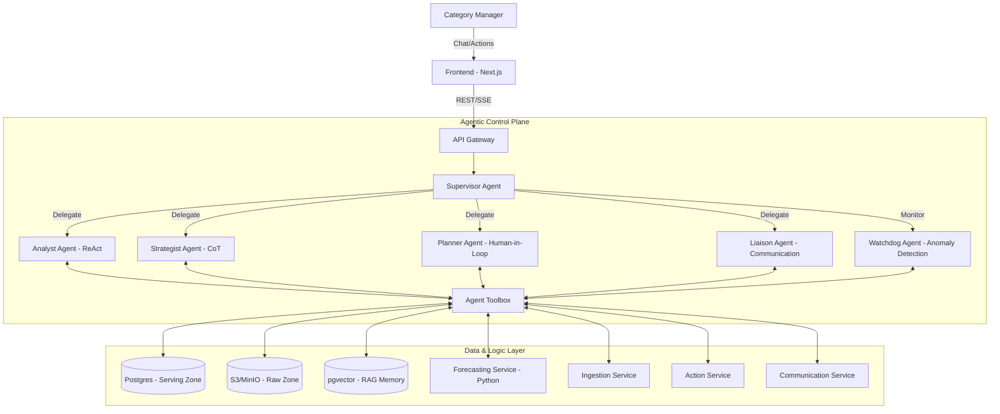
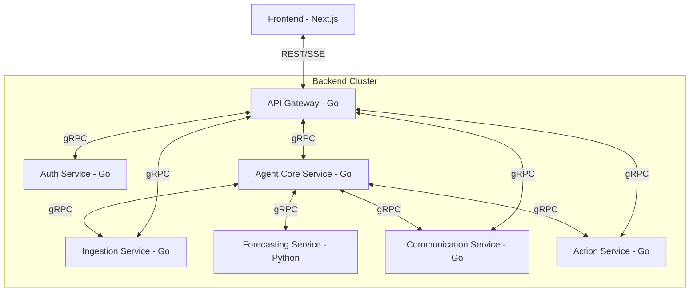
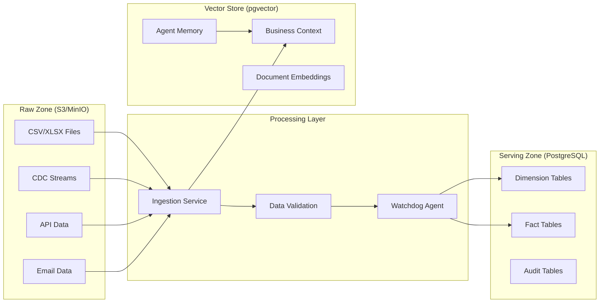
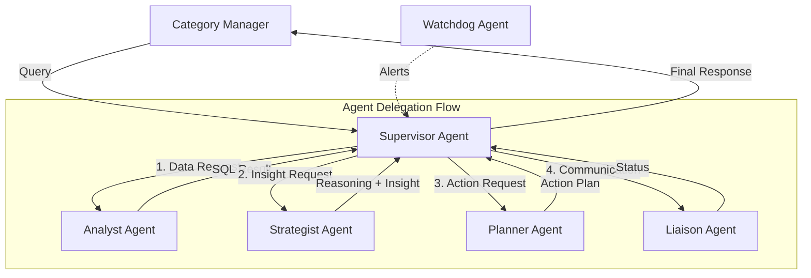
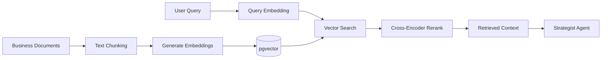
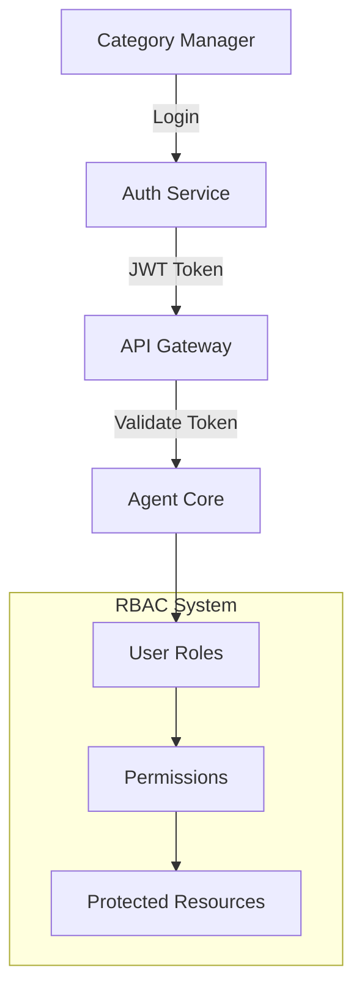

# Design Document: AI Category Manager - Agentic Decision Intelligence Platform

## Overview

The AI Category Manager (AI-CM) is an **Agentic Decision Intelligence Platform** that transforms category management from reactive analysis to proactive decision intelligence. Unlike traditional chatbots or dashboards, AI-CM employs a **Multi-Agent System** where specialized AI agents collaborate to provide autonomous category management capabilities.

The system addresses the core problem that Category Managers spend 50-60% of their time on manual data gathering instead of strategic decision-making. AI-CM provides:

- **End-to-end category lifecycle visibility**: From SKU onboarding to customer feedback
- **LLM-powered reasoning layer**: Explains "why" something happened, not just "what"
- **Closed-loop execution**: Approved actions are automatically executed in operational systems
- **Proactive intelligence**: Detects anomalies and suggests actions before problems escalate

**Key Design Principles:**
1. **Agentic Architecture**: Specialized agents with distinct cognitive patterns (ReAct, CoT, Human-in-Loop)
2. **Grounded Intelligence**: All insights backed by data, no hallucinations
3. **Human-in-the-loop**: Critical decisions require user approval
4. **Transparency**: Always cite data sources and confidence levels
5. **Continuous Learning**: Feedback loops improve recommendations over time

## Architecture

### High-Level Agentic Architecture



### Microservices Architecture



## Agentic Components and Cognitive Patterns

### 1. Supervisor Agent (Orchestrator Pattern)

**Responsibility:** Central orchestrator that manages conversation flow, delegates to specialized agents, and maintains session state.

**Cognitive Pattern:** Hub-and-Spoke coordination with intent classification

**Interface:**
```go
type SupervisorAgent interface {
    // Process user query and orchestrate response
    ProcessQuery(ctx context.Context, sessionID string, query string) (*SupervisorResponse, error)
    
    // Delegate to specialized agent
    DelegateToAgent(ctx context.Context, agent AgentType, task *AgentTask) (*AgentResult, error)
    
    // Manage conversation context
    UpdateContext(sessionID string, update *ContextUpdate) error
    
    // Coordinate multi-agent workflows
    Orchestrate Workflow(ctx context.Context, workflow *WorkflowDefinition) (*WorkflowResult, error)
}

type SupervisorResponse struct {
    Response string             `json:"response"`
    Insights []Insight          `json:"insights"`
    Actions  []ActionSuggestion `json:"actions"`
    Metadata ResponseMetadata   `json:"metadata"`
}

type AgentType string

const (
    AgentTypeAnalyst    AgentType = "analyst"
    AgentTypeStrategist AgentType = "strategist"
    AgentTypePlanner    AgentType = "planner"
    AgentTypeLiaison    AgentType = "liaison"
    AgentTypeWatchdog   AgentType = "watchdog"
)
```

**Key Behaviors:**
- Classifies user intent and routes to appropriate agents
- Prevents agent conflicts through centralized state management
- Aggregates results from multiple agents into coherent responses
- Maintains conversation context and session persistence

### 2. Analyst Agent (ReAct Pattern)

**Responsibility:** Converts natural language to SQL, executes queries, and self-corrects errors.

**Cognitive Pattern:** Reason → Act → Observe → Reason (ReAct Loop)

**Interface:**
```go
type AnalystAgent interface {
    // Execute ReAct loop for data retrieval
    ExecuteQuery(ctx context.Context, query string, queryCtx *QueryContext) (*QueryResult, error)
    
    // Generate SQL from natural language
    GenerateSQL(ctx context.Context, nlQuery string, schema *DatabaseSchema) (*SQLQuery, error)
    
    // Self-correct SQL errors
    CorrectSQL(ctx context.Context, sql string, sqlErr *SQLError) (*SQLQuery, error)
    
    // Validate query safety
    ValidateQuery(sql string) *ValidationResult
}

type QueryResult struct {
    Data           []map[string]interface{} `json:"data"`
    Metadata       QueryMetadata            `json:"metadata"`
    ExecutionSteps []ReActStep              `json:"execution_steps"`
    Confidence     float64                  `json:"confidence"`
}

type ReActStep struct {
    Type      StepType  `json:"type"`
    Content   string    `json:"content"`
    Timestamp time.Time `json:"timestamp"`
    Success   bool      `json:"success"`
}

type StepType string

const (
    StepTypeThought    StepType = "thought"
    StepTypeAction     StepType = "action"
    StepTypeObservation StepType = "observation"
    StepTypeCorrection StepType = "correction"
)
```

**ReAct Flow Example:**
```
Thought: User wants sales data for East region
Action: get_table_schema('fact_sales')
Observation: Table has columns: region, product_id, sales_amount, date
Thought: Need to filter by region = 'East'
Action: run_sql("SELECT * FROM fact_sales WHERE region = 'East'")
Observation: Error - column 'region' doesn't exist
Thought: Let me check the correct column name
Action: get_table_schema('fact_sales') 
Observation: Column is named 'region_name'
Action: run_sql("SELECT * FROM fact_sales WHERE region_name = 'East'")
Observation: Query successful, 1,234 rows returned
```

### 3. Strategist Agent (Chain-of-Thought Pattern)

**Responsibility:** Provides reasoning and explains "why" insights using business context and RAG.

**Cognitive Pattern:** Chain-of-Thought reasoning with RAG retrieval

**Interface:**
```go
type StrategistAgent interface {
    // Generate insights with reasoning
    GenerateInsight(ctx context.Context, data *QueryResult, bizCtx *BusinessContext) (*Insight, error)
    
    // Explain trends and anomalies
    ExplainTrend(ctx context.Context, trendData *TrendData) (*Explanation, error)
    
    // Retrieve business context via RAG
    RetrieveContext(ctx context.Context, query string) (*BusinessContext, error)
    
    // Perform root cause analysis
    AnalyzeRootCause(ctx context.Context, anomaly *AnomalyData) (*RootCauseAnalysis, error)
}

type Insight struct {
    Type            InsightType      `json:"type"`
    Title           string           `json:"title"`
    Reasoning       ReasoningChain   `json:"reasoning"`
    Confidence      float64          `json:"confidence"`
    BusinessContext BusinessContext  `json:"business_context"`
    SupportingData  interface{}      `json:"supporting_data"`
}

type ReasoningChain struct {
    Steps       []ReasoningStep `json:"steps"`
    Conclusion  string          `json:"conclusion"`
    Assumptions []string        `json:"assumptions"`
}

type ReasoningStep struct {
    Step       int         `json:"step"`
    Thought    string      `json:"thought"`
    Evidence   interface{} `json:"evidence"`
    Confidence float64     `json:"confidence"`
}

type InsightType string

const (
    InsightTypeTrendAnalysis           InsightType = "trend_analysis"
    InsightTypeAnomalyDetection       InsightType = "anomaly_detection"
    InsightTypeOpportunityIdentification InsightType = "opportunity_identification"
    InsightTypeRiskAssessment         InsightType = "risk_assessment"
    InsightTypeCompetitiveAnalysis    InsightType = "competitive_analysis"
)
```

**Chain-of-Thought Example:**
```
Step 1: Sales dropped 15% in East region last week
Step 2: Checking inventory levels... Inventory is normal (not a supply issue)
Step 3: Checking competitor data... Competitor X reduced prices by 12%
Step 4: Checking historical patterns... Similar price drops led to 10-20% sales decline
Step 5: Conclusion: Sales drop is likely due to competitive pricing pressure
Confidence: 85%
```

### 4. Planner Agent (Human-in-the-Loop Pattern)

**Responsibility:** Proposes actions, manages approvals, and executes approved actions.

**Cognitive Pattern:** Plan → Present → Approve → Execute

**Interface:**
```go
type PlannerAgent interface {
    // Generate action recommendations
    GenerateActions(ctx context.Context, insight *Insight) (*ActionPlan, error)
    
    // Present actions for approval
    PresentForApproval(ctx context.Context, actions []ActionSuggestion) (*ApprovalRequest, error)
    
    // Execute approved actions
    ExecuteAction(ctx context.Context, action *ApprovedAction) (*ExecutionResult, error)
    
    // Track action outcomes
    TrackOutcome(ctx context.Context, actionID string) (*ActionOutcome, error)
}

type ActionPlan struct {
    Actions        []ActionSuggestion `json:"actions"`
    Priority       Priority           `json:"priority"`
    ExpectedImpact ImpactEstimate     `json:"expected_impact"`
    Risks          []Risk             `json:"risks"`
    Timeline       Timeline           `json:"timeline"`
}

type ActionSuggestion struct {
    ID               string           `json:"id"`
    Type             ActionType       `json:"type"`
    Description      string           `json:"description"`
    Parameters       ActionParameters `json:"parameters"`
    Confidence       float64          `json:"confidence"`
    ExpectedImpact   string           `json:"expected_impact"`
    Risks            []string         `json:"risks"`
    RequiresApproval bool             `json:"requires_approval"`
}

type ActionType string

const (
    ActionTypePriceUpdate        ActionType = "price_update"
    ActionTypeInventoryAdjustment ActionType = "inventory_adjustment"
    ActionTypePromotionCreate    ActionType = "promotion_create"
    ActionTypeSellerCommunication ActionType = "seller_communication"
    ActionTypeForecastAdjustment ActionType = "forecast_adjustment"
)

type ApprovalRequest struct {
    RequestID     string            `json:"request_id"`
    Actions       []ActionSuggestion `json:"actions"`
    Justification string            `json:"justification"`
    Deadline      time.Time         `json:"deadline"`
    Approver      string            `json:"approver"`
}
```

### 5. Liaison Agent (Communication Pattern)

**Responsibility:** Handles communication with sellers, generates reports, and manages notifications.

**Cognitive Pattern:** Template-based generation with personalization

**Interface:**
```go
type LiaisonAgent interface {
    // Send compliance alerts
    SendComplianceAlert(ctx context.Context, seller *Seller, violation *ComplianceViolation) (*CommunicationResult, error)
    
    // Generate performance reports
    GeneratePerformanceReport(ctx context.Context, seller *Seller, period *TimePeriod) (*Report, error)
    
    // Send feedback to sellers
    SendFeedback(ctx context.Context, seller *Seller, feedback *PerformanceFeedback) (*CommunicationResult, error)
    
    // Generate executive summaries
    GenerateExecutiveSummary(ctx context.Context, data *CategoryData) (*ExecutiveSummary, error)
}

type CommunicationResult struct {
    MessageID    string              `json:"message_id"`
    Status       CommunicationStatus `json:"status"`
    DeliveryTime time.Time           `json:"delivery_time"`
    Recipient    string              `json:"recipient"`
    Template     string              `json:"template"`
}

type CommunicationStatus string

const (
    CommunicationStatusSent      CommunicationStatus = "sent"
    CommunicationStatusDelivered CommunicationStatus = "delivered"
    CommunicationStatusFailed    CommunicationStatus = "failed"
    CommunicationStatusBounced   CommunicationStatus = "bounced"
)
```

### 6. Watchdog Agent (Monitoring Pattern)

**Responsibility:** Monitors data quality, detects anomalies, and alerts on system issues.

**Cognitive Pattern:** Continuous monitoring with threshold-based alerting

**Interface:**
```go
type WatchdogAgent interface {
    // Monitor data ingestion
    MonitorIngestion(ctx context.Context) (*IngestionHealth, error)
    
    // Detect data anomalies
    DetectAnomalies(ctx context.Context, data *TimeSeriesData) ([]Anomaly, error)
    
    // Validate data quality
    ValidateDataQuality(ctx context.Context, dataset *Dataset) (*QualityReport, error)
    
    // Alert on issues
    AlertOnIssue(ctx context.Context, issue *SystemIssue) (*AlertResult, error)
}

type Anomaly struct {
    Type          AnomalyType `json:"type"`
    Severity      Severity    `json:"severity"`
    Description   string      `json:"description"`
    AffectedData  []string    `json:"affected_data"`
    DetectionTime time.Time   `json:"detection_time"`
    Confidence    float64     `json:"confidence"`
}

type AnomalyType string

const (
    AnomalyTypeSchemaDrift     AnomalyType = "schema_drift"
    AnomalyTypeDataQuality     AnomalyType = "data_quality"
    AnomalyTypeVolumeAnomaly   AnomalyType = "volume_anomaly"
    AnomalyTypePatternDeviation AnomalyType = "pattern_deviation"
)
```

## Data Architecture - Logical Lakehouse

### Data Zones



### Database Schema

**Dimension Tables:**
```sql
-- Products dimension
CREATE TABLE dim_products (
    product_id VARCHAR(50) PRIMARY KEY,
    product_name VARCHAR(255),
    category VARCHAR(100),
    subcategory VARCHAR(100),
    brand VARCHAR(100),
    created_at TIMESTAMP,
    updated_at TIMESTAMP
);

-- Sellers dimension  
CREATE TABLE dim_sellers (
    seller_id VARCHAR(50) PRIMARY KEY,
    seller_name VARCHAR(255),
    region VARCHAR(100),
    tier VARCHAR(50),
    created_at TIMESTAMP
);

-- Locations dimension
CREATE TABLE dim_locations (
    location_id VARCHAR(50) PRIMARY KEY,
    region VARCHAR(100),
    state VARCHAR(100),
    city VARCHAR(100),
    pincode VARCHAR(10)
);
```

**Fact Tables:**
```sql
-- Sales fact table
CREATE TABLE fact_sales (
    sale_id BIGSERIAL PRIMARY KEY,
    product_id VARCHAR(50) REFERENCES dim_products(product_id),
    seller_id VARCHAR(50) REFERENCES dim_sellers(seller_id),
    location_id VARCHAR(50) REFERENCES dim_locations(location_id),
    sale_date DATE,
    quantity INTEGER,
    unit_price DECIMAL(10,2),
    total_amount DECIMAL(12,2),
    margin_percent DECIMAL(5,2),
    created_at TIMESTAMP DEFAULT NOW()
);

-- Inventory fact table
CREATE TABLE fact_inventory (
    inventory_id BIGSERIAL PRIMARY KEY,
    product_id VARCHAR(50) REFERENCES dim_products(product_id),
    seller_id VARCHAR(50) REFERENCES dim_sellers(seller_id),
    location_id VARCHAR(50) REFERENCES dim_locations(location_id),
    stock_date DATE,
    current_stock INTEGER,
    reserved_stock INTEGER,
    available_stock INTEGER,
    reorder_level INTEGER,
    created_at TIMESTAMP DEFAULT NOW()
);

-- Forecasts fact table
CREATE TABLE fact_forecasts (
    forecast_id BIGSERIAL PRIMARY KEY,
    product_id VARCHAR(50) REFERENCES dim_products(product_id),
    location_id VARCHAR(50) REFERENCES dim_locations(location_id),
    forecast_date DATE,
    predicted_demand INTEGER,
    confidence_interval_lower INTEGER,
    confidence_interval_upper INTEGER,
    model_version VARCHAR(50),
    created_at TIMESTAMP DEFAULT NOW()
);
```

**Agent Tables:**
```sql
-- Agent sessions
CREATE TABLE agent_sessions (
    session_id UUID PRIMARY KEY,
    user_id VARCHAR(50),
    start_time TIMESTAMP,
    last_activity TIMESTAMP,
    context JSONB,
    status VARCHAR(20)
);

-- Agent messages
CREATE TABLE agent_messages (
    message_id UUID PRIMARY KEY,
    session_id UUID REFERENCES agent_sessions(session_id),
    agent_type VARCHAR(50),
    message_type VARCHAR(50),
    content TEXT,
    metadata JSONB,
    created_at TIMESTAMP DEFAULT NOW()
);

-- Agent actions
CREATE TABLE agent_actions (
    action_id UUID PRIMARY KEY,
    session_id UUID REFERENCES agent_sessions(session_id),
    action_type VARCHAR(50),
    parameters JSONB,
    status VARCHAR(20),
    result JSONB,
    executed_at TIMESTAMP,
    approved_by VARCHAR(50)
);
```

**Vector Store Schema:**
```sql
-- Enable pgvector extension
CREATE EXTENSION IF NOT EXISTS vector;

-- Business context embeddings
CREATE TABLE business_context (
    id UUID PRIMARY KEY,
    content TEXT,
    embedding vector(1536),
    metadata JSONB,
    created_at TIMESTAMP DEFAULT NOW()
);

-- Agent memory embeddings
CREATE TABLE agent_memory (
    id UUID PRIMARY KEY,
    agent_type VARCHAR(50),
    memory_type VARCHAR(50),
    content TEXT,
    embedding vector(1536),
    metadata JSONB,
    created_at TIMESTAMP DEFAULT NOW()
);

-- Create vector similarity indexes
CREATE INDEX ON business_context USING ivfflat (embedding vector_cosine_ops);
CREATE INDEX ON agent_memory USING ivfflat (embedding vector_cosine_ops);
```

## Agent Communication Patterns

### Hub-and-Spoke Architecture



### Inter-Agent Communication Protocol

**Message Format:**
```go
type AgentMessage struct {
    ID            string      `json:"id"`
    From          AgentType   `json:"from"`
    To            AgentType   `json:"to"`
    Type          MessageType `json:"type"`
    Payload       interface{} `json:"payload"`
    Timestamp     time.Time   `json:"timestamp"`
    CorrelationID string      `json:"correlation_id"`
}

type MessageType string

const (
    MessageTypeTaskRequest   MessageType = "task_request"
    MessageTypeTaskResponse  MessageType = "task_response"
    MessageTypeError         MessageType = "error"
    MessageTypeStatusUpdate  MessageType = "status_update"
    MessageTypeAlert         MessageType = "alert"
)
```

**Communication Patterns:**
1. **Request-Response**: Supervisor → Agent → Supervisor
2. **Fire-and-Forget**: Supervisor → Liaison (for notifications)
3. **Event-Driven**: Watchdog → Supervisor (for alerts)
4. **Broadcast**: Supervisor → All Agents (for shutdown/config updates)

## RAG System Architecture

### Document Processing Pipeline



### Business Context Types

**Policy Documents:**
- Pricing policies and guidelines
- Inventory management procedures
- Seller compliance requirements
- Category management best practices

**Historical Decisions:**
- Past successful actions and outcomes
- Failed strategies and lessons learned
- Seasonal patterns and trends
- Competitive response strategies

**Market Intelligence:**
- Industry reports and analysis
- Competitor intelligence
- Customer behavior insights
- Regional market characteristics

## Error Handling and Resilience

### Agent-Level Error Handling

**Analyst Agent Errors:**
```go
// SQL Generation Error Recovery
func (a *AnalystAgent) executeQueryWithRetry(ctx context.Context, query string, maxRetries int) (*QueryResult, error) {
    if maxRetries == 0 {
        maxRetries = 3
    }
    
    for attempt := 1; attempt <= maxRetries; attempt++ {
        sql, err := a.GenerateSQL(ctx, query, a.schema)
        if err != nil {
            return nil, fmt.Errorf("failed to generate SQL: %w", err)
        }
        
        result, err := a.executeSQL(ctx, sql.Query)
        if err != nil {
            var sqlErr *SQLSyntaxError
            if errors.As(err, &sqlErr) && attempt < maxRetries {
                // Self-correct using error message
                correctedSQL, corrErr := a.CorrectSQL(ctx, sql.Query, &SQLError{Message: err.Error()})
                if corrErr == nil {
                    query = correctedSQL.Query
                    continue
                }
            }
            return nil, fmt.Errorf("failed after %d attempts: %w", attempt, err)
        }
        
        return result, nil
    }
    
    return nil, fmt.Errorf("failed after %d attempts", maxRetries)
}
```

**Strategist Agent Errors:**
```go
// RAG Retrieval Fallback
func (s *StrategistAgent) generateInsightWithFallback(ctx context.Context, data *QueryResult) (*Insight, error) {
    context, err := s.RetrieveContext(ctx, data.Query)
    if err != nil {
        // Fallback to basic analysis without RAG
        log.Warn("RAG retrieval failed, falling back to basic analysis", "error", err)
        return s.generateBasicInsight(ctx, data)
    }
    
    return s.generateInsightWithContext(ctx, data, context)
}
```

### System-Level Resilience

**Circuit Breaker Pattern:**
- Prevent cascading failures between agents
- Automatic recovery when services become available
- Graceful degradation of functionality

**Bulkhead Pattern:**
- Isolate agent failures to prevent system-wide impact
- Separate thread pools for different agent types
- Resource isolation for critical vs. non-critical operations

**Retry Strategies:**
- Exponential backoff for transient failures
- Different retry policies for different error types
- Maximum retry limits to prevent infinite loops

## Security Architecture

### Authentication and Authorization



**Role-Based Access Control:**
- **Category Manager**: Full access to category data and actions
- **Senior Manager**: Read-only access + approval permissions
- **Analyst**: Read-only access to data and insights
- **System Admin**: Full system access and configuration

### Data Security

**SQL Injection Prevention:**
- Parameterized queries only
- SQL query validation and sanitization
- Read-only database connections for Analyst Agent
- Query complexity limits and timeouts

**Data Privacy:**
- PII detection and masking in responses
- Audit logging of all data access
- Encryption at rest and in transit
- Data retention policies and automated cleanup

## Performance Optimization

### Caching Strategy

**Multi-Level Caching:**
```go
type CacheStrategy struct {
    // L1: In-memory cache for frequently accessed data
    MemoryCache sync.Map
    
    // L2: Redis cache for session data and intermediate results
    RedisClient *redis.Client
    
    // L3: Database query result cache
    QueryCache *QueryResultCache
}

type CachedResult struct {
    Data      interface{} `json:"data"`
    Timestamp time.Time   `json:"timestamp"`
    TTL       int         `json:"ttl"`
}

// Cache TTL by data type (in seconds)
var CacheTTL = map[string]int{
    "DASHBOARD_METRICS": 300,  // 5 minutes
    "PRICING_DATA":      600,  // 10 minutes  
    "INVENTORY_DATA":    180,  // 3 minutes
    "COMPETITOR_DATA":   3600, // 1 hour
    "FORECASTS":         86400, // 24 hours
    "BUSINESS_CONTEXT":  604800, // 7 days
}
```

### Database Optimization

**Query Optimization:**
- Indexed columns for common query patterns
- Materialized views for complex aggregations
- Partitioning for time-series data
- Connection pooling and prepared statements

**Read Replicas:**
- Separate read replicas for analytics queries
- Load balancing across multiple replicas
- Automatic failover for high availability

### Agent Performance

**Parallel Processing:**
- Concurrent agent execution using goroutines where possible
- Context-based cancellation for I/O operations
- Worker pools for CPU-intensive tasks
- Channel-based processing for background tasks

**Resource Management:**
- Memory limits for each agent type
- CPU throttling for non-critical operations
- Graceful degradation under high load
- Auto-scaling based on demand metrics

## Monitoring and Observability

### Metrics Collection

**Agent Metrics:**
- Response times by agent type
- Success/failure rates
- Queue depths and processing times
- Resource utilization (CPU, memory)

**Business Metrics:**
- Query types and frequencies
- User engagement patterns
- Action execution rates
- Insight accuracy scores

### Logging Strategy

**Structured Logging:**
```go
type LogEntry struct {
    Timestamp time.Time              `json:"timestamp"`
    Level     LogLevel               `json:"level"`
    Service   string                 `json:"service"`
    AgentType *AgentType             `json:"agent_type,omitempty"`
    SessionID *string                `json:"session_id,omitempty"`
    UserID    *string                `json:"user_id,omitempty"`
    Message   string                 `json:"message"`
    Metadata  map[string]interface{} `json:"metadata"`
    TraceID   string                 `json:"trace_id"`
}

type LogLevel string

const (
    LogLevelDebug LogLevel = "debug"
    LogLevelInfo  LogLevel = "info"
    LogLevelWarn  LogLevel = "warn"
    LogLevelError LogLevel = "error"
    LogLevelFatal LogLevel = "fatal"
)
```

**Log Aggregation:**
- Centralized logging with ELK stack
- Distributed tracing with Jaeger
- Real-time alerting on error patterns
- Log retention and archival policies

### Health Monitoring

**Service Health Checks:**
- Liveness probes for all services
- Readiness probes for database connections
- Dependency health monitoring
- Automated recovery procedures

**Performance Monitoring:**
- Response time percentiles (P50, P95, P99)
- Error rate tracking and alerting
- Resource utilization monitoring
- Capacity planning metrics properties across all inputs

Both approaches are complementary and necessary. Unit tests catch concrete bugs in specific scenarios, while property tests verify general correctness across a wide range of inputs.

### Property-Based Testing Configuration

**Library Selection**: Use `gopter` for Go property-based testing

**Configuration**:
- Minimum 100 iterations per property test (due to randomization)
- Each property test must reference its design document property
- Tag format: `// Feature: ai-cm-platform, Property {number}: {property_text}`

**Example Property Test Structure**:
```go
import (
    "testing"
    "github.com/leanovate/gopter"
    "github.com/leanovate/gopter/gen"
    "github.com/leanovate/gopter/prop"
)

func TestIntentParserProperties(t *testing.T) {
    properties := gopter.NewProperties(nil)
    
    // Feature: ai-cm-platform, Property 1: Intent Recognition Accuracy
    properties.Property("Intent Recognition Accuracy", prop.ForAll(
        func(query string, expectedIntent IntentType) bool {
            parser := NewIntentParser()
            result := parser.ParseQuery(context.Background(), query, &ConversationContext{})
            
            if result.Confidence > CONFIDENCE_THRESHOLD {
                return result.Intent == expectedIntent
            }
            return true // Skip low confidence results
        },
        gen.AnyString(),
        gen.OneConstOf(
            IntentTypeQueryMetrics,
            IntentTypeComparePeriods,
            IntentTypeAnalyzeTrend,
            IntentTypeGetRecommendations,
        ),
    ))
    
    properties.TestingRun(t, gopter.ConsoleReporter(false))
}
```

### Unit Testing Strategy

**Focus Areas for Unit Tests**:
1. **Specific Examples**: Test concrete queries with known expected outputs
2. **Edge Cases**: Empty queries, very long queries, special characters
3. **Error Conditions**: Network failures, timeouts, malformed data
4. **Integration Points**: Component interactions, API calls, storage operations

**Unit Test Balance**:
- Avoid writing too many unit tests for scenarios covered by property tests
- Focus unit tests on specific examples that demonstrate correct behavior
- Use unit tests for integration testing between components
- Property tests handle comprehensive input coverage

**Example Unit Test Structure**:
```go
func TestSupervisorAgent(t *testing.T) {
    t.Run("should initialize empty context on session start", func(t *testing.T) {
        supervisor := NewSupervisorAgent()
        sessionID := supervisor.StartSession()
        context := supervisor.GetContext(sessionID)
        
        assert.Empty(t, context.Messages)
        assert.Empty(t, context.Entities)
        assert.Equal(t, sessionID, context.SessionID)
    })
    
    t.Run("should handle network error gracefully", func(t *testing.T) {
        mockAPI := &MockAnalyticsAPI{}
        mockAPI.On("GetDashboardMetrics").Return(nil, errors.New("network error"))
        
        supervisor := NewSupervisorAgent(WithAnalyticsAPI(mockAPI))
        
        response, err := supervisor.ProcessQuery(context.Background(), sessionID, "Show metrics")
        
        require.NoError(t, err)
        assert.Equal(t, MessageTypeError, response.Type)
        assert.Contains(t, response.Content.Text, "Unable to connect")
        
        context := supervisor.GetContext(sessionID)
        assert.Greater(t, len(context.Messages), 0)
    })
}
```

### Test Coverage Goals

**Component Coverage**:
- Supervisor Agent: 90%+ coverage
- Analyst Agent: 85%+ coverage (complex SQL generation logic)
- Strategist Agent: 85%+ coverage (RAG and reasoning logic)
- Planner Agent: 90%+ coverage
- Liaison Agent: 80%+ coverage (template-based)
- Watchdog Agent: 85%+ coverage

**Property Test Coverage**:
- All 45 correctness properties must have corresponding property tests
- Each property test must run minimum 100 iterations
- Property tests should use appropriate generators for domain-specific data

**Integration Test Coverage**:
- End-to-end query flow: query → parse → route → aggregate → respond
- Session persistence: save → load → verify
- Error recovery: trigger error → verify graceful handling → verify recovery
- Multi-source queries: verify parallel execution and aggregation

### Test Data Generators

**For Property-Based Testing**:
```go
// Query generators
var queryGenerator = gen.OneConstOf(
    "What are the top performers?",
    "Show sales trends", 
    "Compare this month to last month",
).Map(func(base string) string {
    return fmt.Sprintf("Show %s data", base)
})

// Intent generators
var intentGenerator = gen.Struct(reflect.TypeOf(&ParsedIntent{}), map[string]gopter.Gen{
    "Intent":      gen.OneConstOf(IntentTypeQueryMetrics, IntentTypeAnalyzeTrend, IntentTypeComparePeriods),
    "Entities":    gen.SliceOf(entityGenerator),
    "DataSources": gen.SliceOf(gen.OneConstOf(DataSourceDashboard, DataSourcePricing, DataSourceInventory)),
    "Confidence":  gen.Float64Range(0, 1),
})

// Context generators
var contextGenerator = gen.Struct(reflect.TypeOf(&ConversationContext{}), map[string]gopter.Gen{
    "SessionID":   gen.UUIDGen(),
    "Messages":    gen.SliceOf(messageGenerator),
    "CurrentPage": pageContextGenerator,
    "Entities":    gen.MapOf(gen.AnyString(), gen.AnyString()),
    "Timestamp":   gen.TimeRange(time.Now().Add(-24*time.Hour), time.Now()),
})

// Message generators
var messageGenerator = gen.Struct(reflect.TypeOf(&Message{}), map[string]gopter.Gen{
    "ID":        gen.UUIDGen(),
    "Type":      gen.OneConstOf(MessageTypeUserQuery, MessageTypeBotResponse, MessageTypeInsight),
    "Content":   gen.AnyString(),
    "Timestamp": gen.TimeRange(time.Now().Add(-time.Hour), time.Now()),
    "Metadata": gen.Struct(reflect.TypeOf(&MessageMetadata{}), map[string]gopter.Gen{
        "Intent":        gen.PtrOf(gen.OneConstOf(IntentTypeQueryMetrics, IntentTypeAnalyzeTrend)),
        "DataSources":   gen.SliceOf(gen.OneConstOf(DataSourceDashboard, DataSourcePricing)),
        "ExecutionTime": gen.IntRange(0, 5000),
    }),
})
```

### Continuous Testing

**Pre-commit Hooks**:
- Run unit tests for changed files
- Run linting and type checking
- Verify no console.log statements

**CI/CD Pipeline**:
- Run full unit test suite
- Run property tests (100 iterations each)
- Run integration tests
- Generate coverage report
- Fail build if coverage drops below thresholds

**Performance Testing**:
- Monitor response times for simple queries (< 2s)
- Monitor response times for complex queries (< 5s)
- Track cache hit rates
- Monitor error rates by category
