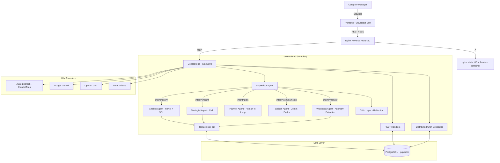
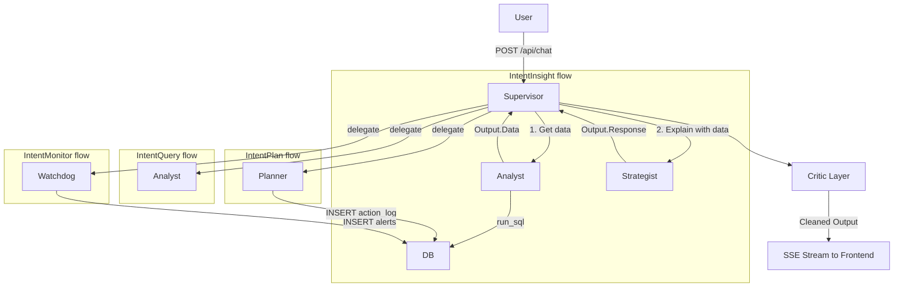
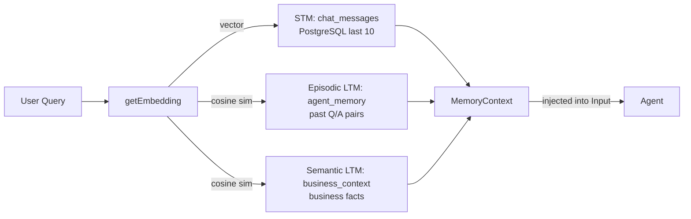

# Design Document: AI Category Manager - Agentic Decision Intelligence Platform

## Overview

The AI Category Manager (AI-CM) is an **Agentic Decision Intelligence Platform** that transforms category management from reactive analysis to proactive decision intelligence. Unlike traditional chatbots or dashboards, AI-CM employs a **Multi-Agent System** where specialized AI agents collaborate to provide autonomous category management capabilities.

The system addresses the core problem that Category Managers spend 50-60% of their time on manual data gathering instead of strategic decision-making. AI-CM provides:

- **End-to-end category lifecycle visibility**: From SKU onboarding to customer feedback
- **LLM-powered reasoning layer**: Explains "why" something happened, not just "what"
- **Human-in-the-loop execution**: Approved actions are tracked in an action log for review
- **Proactive intelligence**: Detects anomalies and suggests actions before problems escalate

**Key Design Principles:**
1. **Agentic Architecture**: Specialized agents with distinct cognitive patterns (ReAct, CoT, Human-in-Loop, Reflection)
2. **Grounded Intelligence**: All insights backed by real SQL queries — no hallucinations
3. **Human-in-the-loop**: Critical decisions require user approval before execution
4. **Transparency**: Reasoning steps streamed to the UI via SSE; data sources always cited
5. **Continuous Learning**: 3-tier memory system stores past interactions for context enrichment

## Architecture

### High-Level System Architecture

The backend is a **unified Go monolith** (Gin HTTP server) containing all agent logic. The frontend is a **Vite + React SPA** served as static files via nginx.



## Agentic Components and Cognitive Patterns

All agents implement a single interface:

```go
// Agent is the interface that all agents must implement.
type Agent interface {
    Process(ctx context.Context, input *Input) (*Output, error)
    Name() string
}

// Input is passed from the Supervisor to every agent.
type Input struct {
    Query         string                `json:"query"`
    SessionID     string                `json:"session_id"`
    Context       map[string]any        `json:"context,omitempty"`
    History       []Message             `json:"history,omitempty"`
    MemoryContext *memory.MemoryContext `json:"memory_context,omitempty"`
}

// Output is the standardized agent response.
type Output struct {
    Response  string             `json:"response"`
    Data      any                `json:"data,omitempty"`
    AgentName string             `json:"agent_name"`
    Reasoning []ReasoningStep    `json:"reasoning,omitempty"`
    Actions   []ActionSuggestion `json:"actions,omitempty"`
}
```

### 1. Supervisor Agent (Orchestrator Pattern)

**File:** `src/backend/internal/agent/supervisor.go`

**Responsibility:** Central hub that classifies user intent and delegates to the appropriate worker agent. Enriches every request with 3-tier memory context before delegation. Runs the Critic layer post-response.

**Intent Types:**

| Intent | Trigger keywords | Delegates to |
|--------|-----------------|--------------|
| `query` | data questions, "show me", "how many" | Analyst |
| `insight` | "why", "explain", "analyze", "trend" | Analyst → Strategist |
| `plan` | "plan", "propose", "recommend", "action" | Planner |
| `communicate` | "draft", "email", "notify", "report to" | Liaison |
| `monitor` | "anomaly", "watchdog", "system health" | Watchdog |
| `general` | greetings, "hello", "what can you do" | Static response |

**Classification:** LLM-first (few-shot prompt, 20 token max, 15s timeout) with keyword heuristic fallback.

**Per-agent LLM model** override: `config.yaml → llm.agent_models` map keyed by agent name.

### 2. Analyst Agent (ReAct Pattern)

**File:** `src/backend/internal/agent/analyst.go`

**Responsibility:** Natural language → SQL → execute → summarize. Implements a 3-tier SQL cache.

**SQL Cache (fastest to slowest):**
1. **L2 Vector cache** (`agent_memory`, `memory_type='sql_cache'`): pgvector cosine similarity ≥ 0.92, 24-hour TTL — catches semantically similar queries
2. **L1 In-process cache** (`SQLCache`, 15-min TTL, 100 entries): exact bag-of-words match
3. **LLM generation**: up to 3 retries with error feedback; validates via `looksLikeSQL()` before executing

**SQL safety:** `SanitizeSQL()` blocks all write operations (DROP, DELETE, UPDATE, INSERT, etc.).

**ReAct Flow:**
```
Thought → Generate SQL → Execute → [Error? → retry with error feedback] → Summarize results
```

**Schema awareness:** `SchemaCache` (30-min TTL) auto-fetches table/column metadata from PostgreSQL `information_schema`.

### 3. Strategist Agent (Chain-of-Thought Pattern)

**File:** `src/backend/internal/agent/strategist.go`

**Responsibility:** Provides "why" analysis using CoT reasoning over pre-fetched SQL context data.

**Context gathering:** Before calling the LLM, runs 4 parallel SQL queries (sales by region, category performance, inventory alerts, competitor prices) with a 5-minute `ResultCache`. Cache hits are served synchronously; misses run concurrently via goroutines + `sync.WaitGroup`.

**Input enrichment:** Receives analyst data from the Supervisor via `input.Context["analyst_data"]` when invoked as the second step of an `IntentInsight` flow.

### 4. Planner Agent (Human-in-the-Loop Pattern)

**File:** `src/backend/internal/agent/planner.go`

**Responsibility:** Generates structured action proposals via LLM, parses them, and persists them to `action_log` with `status='pending'` for human review.

**Action format parsed from LLM response:**
```
ACTION:
Title: <short title>
Description: <detail>
Type: <action_type>
Confidence: <0.0-1.0>
---
```

**Human-in-loop flow:** Actions are stored with `pending` status → user approves/rejects via the Actions dashboard → status updated to `approved`/`rejected`.

### 5. Liaison Agent (Communication Pattern)

**File:** `src/backend/internal/agent/liaison.go`

**Responsibility:** Drafts professional communications (emails, reports, alerts, summaries) using prompt templates.

**Communication types classified from query keywords:**

| Type | Keywords | Prompt template |
|------|----------|----------------|
| `compliance_alert` | compliance, violation, policy | inline prompt |
| `performance_report` | report, summary, overview | `liaison_report.md` |
| `seller_feedback` | feedback, review, seller performance | `liaison_email.md` |
| `executive_summary` | executive, leadership, board | `liaison_slack.md` |
| `general` | (default) | `liaison_email.md` |

### 6. Watchdog Agent (Monitoring Pattern)

**File:** `src/backend/internal/agent/watchdog.go`

**Responsibility:** Rule-based anomaly detection using pre-defined SQL checks. Runs on direct chat (`IntentMonitor`) and on a scheduled cron job.

**Detection checks (4 standard + 1 time-based):**

| Check | Threshold | Severity |
|-------|-----------|----------|
| Competitor price drop | < -10% vs own price in last 7 days | critical/warning/info |
| Stockout risk | days_of_supply < 7 AND qty < reorder_level | critical |
| Sales anomaly | week-over-week revenue drop > 20% | warning |
| Excess inventory | days_of_supply > 90 AND qty > 300 | info |
| Stale pending actions | pending > 48 hours old (time-based trigger) | warning |

Anomalies are persisted to the `alerts` table automatically (standard checks only).

### 7. Critic Layer (Reflection Pattern)

**File:** `src/backend/internal/agent/critic.go`

**Responsibility:** Post-processing safety and quality validation applied to every agent output before returning to the user.

**Checks:**
1. **PII detection**: email patterns, phone numbers (10+ digits), Aadhaar numbers (12+ digits) → masks with `[REDACTED]`
2. **Hallucinated tables**: detects `dim_*`, `fact_*`, `tbl_*` prefixed names not in the known schema whitelist
3. **Coherence**: empty responses, suspiciously short responses, LLM failure patterns ("as an AI", "I cannot", etc.)
4. **Confidence sanity**: action confidence scores must be in [0, 1]

### 8. Recommender (Rule-Based Actions)

**File:** `src/backend/internal/agent/recommender.go`

**Responsibility:** Generates rule-based action suggestions from live DB data (independent of LLM) for the `POST /api/actions/generate` endpoint.

**Used by:** `handlers/actions.go` → `generateActions()` handler. Inserts with deduplication (`WHERE NOT EXISTS` on title + pending status).

## Data Architecture

### Database Schema (PostgreSQL + pgvector)

**Dimension Tables:**
```sql
CREATE TABLE dim_products (
    id UUID PRIMARY KEY,
    name VARCHAR(255),
    category VARCHAR(100),
    subcategory VARCHAR(100),
    brand VARCHAR(100),
    mrp DECIMAL(10,2),
    created_at TIMESTAMP DEFAULT NOW()
);

CREATE TABLE dim_sellers (
    id UUID PRIMARY KEY,
    name VARCHAR(255),
    region VARCHAR(100),
    tier VARCHAR(50),
    created_at TIMESTAMP DEFAULT NOW()
);

CREATE TABLE dim_locations (
    id UUID PRIMARY KEY,
    region VARCHAR(100),
    state VARCHAR(100),
    city VARCHAR(100),
    pincode VARCHAR(10)
);
```

**Fact Tables:**
```sql
CREATE TABLE fact_sales (
    id UUID PRIMARY KEY,
    product_id UUID REFERENCES dim_products(id),
    seller_id UUID REFERENCES dim_sellers(id),
    location_id UUID REFERENCES dim_locations(id),
    sale_date DATE,
    quantity INTEGER,
    revenue DECIMAL(12,2),
    margin DECIMAL(12,2),
    discount_pct DECIMAL(5,2),
    created_at TIMESTAMP DEFAULT NOW()
);

CREATE TABLE fact_inventory (
    id UUID PRIMARY KEY,
    product_id UUID REFERENCES dim_products(id),
    location_id UUID REFERENCES dim_locations(id),
    quantity_on_hand INTEGER,
    reorder_level INTEGER,
    days_of_supply INTEGER,
    created_at TIMESTAMP DEFAULT NOW()
);

CREATE TABLE fact_competitor_prices (
    id UUID PRIMARY KEY,
    product_id UUID REFERENCES dim_products(id),
    competitor_name VARCHAR(255),
    competitor_price DECIMAL(10,2),
    price_diff_pct DECIMAL(5,2),
    price_date DATE,
    created_at TIMESTAMP DEFAULT NOW()
);

CREATE TABLE fact_forecasts (
    id UUID PRIMARY KEY,
    product_id UUID REFERENCES dim_products(id),
    location_id UUID REFERENCES dim_locations(id),
    forecast_date DATE,
    predicted_demand INTEGER,
    created_at TIMESTAMP DEFAULT NOW()
);
```

**Operational Tables:**
```sql
-- Human-in-the-loop action queue
CREATE TABLE action_log (
    id UUID PRIMARY KEY,
    title VARCHAR(255),
    description TEXT,
    action_type VARCHAR(100),
    category VARCHAR(100),
    confidence_score DECIMAL(3,2),
    status VARCHAR(20) DEFAULT 'pending',  -- pending | approved | rejected
    product_id UUID REFERENCES dim_products(id),
    created_at TIMESTAMP DEFAULT NOW(),
    updated_at TIMESTAMP DEFAULT NOW()
);

CREATE TABLE action_comments (
    id UUID PRIMARY KEY,
    action_id UUID REFERENCES action_log(id),
    content TEXT,
    user_name VARCHAR(100),
    created_at TIMESTAMP DEFAULT NOW()
);

-- Alerts from Watchdog
CREATE TABLE alerts (
    id UUID PRIMARY KEY,
    title VARCHAR(255),
    severity VARCHAR(20),        -- critical | warning | info
    category VARCHAR(100),
    message TEXT,
    acknowledged BOOLEAN DEFAULT FALSE,
    created_at TIMESTAMP DEFAULT NOW(),
    updated_at TIMESTAMP DEFAULT NOW()
);

-- Distributed cron locking
CREATE TABLE cron_jobs (
    id VARCHAR(100) PRIMARY KEY,
    status VARCHAR(20) DEFAULT 'idle',
    locked_by VARCHAR(255),
    locked_at TIMESTAMP,
    last_run TIMESTAMP,
    next_run TIMESTAMP,
    updated_at TIMESTAMP DEFAULT NOW()
);
```

**Chat / Memory Tables:**
```sql
CREATE TABLE chat_sessions (
    id UUID PRIMARY KEY,
    created_at TIMESTAMP DEFAULT NOW(),
    updated_at TIMESTAMP DEFAULT NOW()
);

CREATE TABLE chat_messages (
    id UUID PRIMARY KEY DEFAULT gen_random_uuid(),
    session_id UUID REFERENCES chat_sessions(id),
    role VARCHAR(20),       -- user | assistant
    content TEXT,
    metadata JSONB,
    created_at TIMESTAMP DEFAULT NOW()
);
```

**Vector Store (pgvector):**
```sql
CREATE EXTENSION IF NOT EXISTS vector;

-- Semantic LTM: business facts and context
CREATE TABLE business_context (
    id UUID PRIMARY KEY,
    content TEXT,
    embedding vector(1536),     -- Amazon Titan Embed v1 (prod) or fake hash (dev)
    metadata JSONB,
    created_at TIMESTAMP DEFAULT NOW()
);

-- Episodic LTM + SQL cache (distinguished by memory_type)
CREATE TABLE agent_memory (
    id UUID PRIMARY KEY,
    agent_type VARCHAR(50),
    memory_type VARCHAR(50),    -- 'episodic' | 'sql_cache'
    content TEXT,               -- episodic: "Q: ...\nA: ..." | sql_cache: "Q: ...\nSQL: ..."
    embedding vector(1536),
    metadata JSONB DEFAULT '{}',
    created_at TIMESTAMP DEFAULT NOW()
);

CREATE INDEX ON business_context USING ivfflat (embedding vector_cosine_ops);
CREATE INDEX ON agent_memory USING ivfflat (embedding vector_cosine_ops);
```

## Agent Communication Patterns

### Hub-and-Spoke Architecture

All inter-agent communication is in-process Go function calls. The Supervisor is the sole orchestrator.



**Reasoning steps** are streamed incrementally via SSE events (`event: reasoning`) so the user can watch the agent think in real time.

## 3-Tier Memory Architecture

**File:** `src/backend/internal/memory/store.go` (implements `memory.Manager` interface)



**Tier 1 — STM (Short-Term Memory):**
- PostgreSQL `chat_messages` table, last 10 messages per session
- Retrieved without embeddings (simple ORDER BY DESC LIMIT)

**Tier 2 — Episodic LTM:**
- `agent_memory` table (`memory_type='episodic'`), top-3 by cosine similarity
- Written after each successful chat turn (goroutine, non-blocking)
- Content: `"Q: {query}\nA: {response}"`

**Tier 3 — Semantic LTM:**
- `business_context` table, top-3 by cosine similarity
- Pre-seeded with business facts; written via `StoreFact()`
- Content: free-form business knowledge

**Embeddings:**
- Production: AWS Bedrock `amazon.titan-embed-text-v1` → 1536-dim vectors
- Development fallback: deterministic LCG hash → 1536-dim (no semantic meaning, consistent shape)

**SQL Cache (L2):**
- `agent_memory` (`memory_type='sql_cache'`), threshold 0.92, 24-hour TTL
- Content: `"Q: {queryText}\nSQL: {sqlText}"`
- Written by Analyst asynchronously after successful LLM-generated SQL execution

**`BuildContext` is parallelized:** one goroutine each for STM, episodic, semantic; embedding is computed once and shared.

## Error Handling and Resilience

### Agent-Level Error Handling

**Analyst — SQL self-correction (3 retries):**
```go
for attempt := 0; attempt < 3; attempt++ {
    if attempt == 0 {
        userPrompt = input.Query
    } else {
        userPrompt = fmt.Sprintf("Previous SQL: %s\nFailed with: %v\nOriginal: %s\nFix the SQL.", sqlQuery, err, input.Query)
    }
    sqlQuery, err = a.llmClient.Generate(ctx, systemPrompt, userPrompt)
    // validate → execute → break on success
}
```

**Analyst — graceful non-SQL fallback:**
- If LLM returns prose instead of SQL, retries with stronger nudge
- On final attempt still non-SQL → returns user-friendly error message
- `OUT_OF_PURVIEW` sentinel from LLM → returns canned out-of-scope message

**Supervisor — agent failure isolation:**
- For `IntentInsight`: Analyst failure is non-fatal; Strategist still runs with reduced context
- Other agents: error propagates as HTTP 200 SSE error event (not a 5xx)

**SSE streaming robustness:**
- Chat handler uses `context.WithoutCancel(reqCtx)` with a 240s timeout — prevents LLM calls from being aborted by nginx's HTTP write timeout
- Episodic memory stored in goroutine (non-blocking — never delays the response)
- Suggestions generated sequentially after the response (depends on response content)

## Security

### API Security

**Configuration:** `src/backend/internal/config/config.go` → `SecurityConfig`

- **Rate limiting** (configurable, default 30 req/min): middleware in `handlers/middleware.go`
- **API key auth** (optional): `api_key_auth_enabled` in config; keys in `api_keys` list
- **CORS**: configurable `allow_origins` list; production locks to frontend domain

**SQL Injection Prevention:**
- `SanitizeSQL()` in `tools.go` blocks all write operations at keyword level
- All DB queries use parameterized pgx queries (no string interpolation)
- LLM-generated SQL is validated before execution

**Data Privacy:**
- `CriticLayer.checkPII()` scans all agent responses before returning to client
- Digit runs ≥ 10 → masked with `[REDACTED]`
- Email-like patterns → flagged with warning

### Authentication
No authentication layer is implemented. The API is intended for internal/intranet use with network-level access control (nginx on EC2 binding to port 80, backend bound to `127.0.0.1:8080`).

## Performance Optimization

### Caching Architecture

No Redis. All caches are in-process or PostgreSQL-backed.

| Cache | Type | TTL | Key | Used by |
|-------|------|-----|-----|---------|
| `SchemaCache` | in-process | 30 min | none (single entry) | Analyst |
| `SQLCache` (L1) | in-process LRU (100 entries) | 15 min | bag-of-words query key | Analyst |
| `agent_memory sql_cache` (L2) | pgvector | 24 hours | cosine sim ≥ 0.92 | Analyst |
| `ResultCache` (strategist) | in-process | 5 min | query key string | Strategist context queries |
| `ResultCache` (watchdog) | in-process | 2 min | check name | Watchdog anomaly checks |

**`ResultCache`** (`src/backend/internal/agent/result_cache.go`): generic TTL cache backed by `sync.Map`, safe for concurrent reads.

### LLM Token Optimization

All LLM clients implement `WithMaxTokens(n int) Client`:
- Intent classification: 20 tokens (single-word response)
- Chat suggestions: 800 tokens (JSON array)
- SQL generation: 4096 tokens (default)
- Summaries/insights: 4096 tokens (default)

### Parallel Execution

**Strategist `gatherContext`:** 4 SQL queries run in parallel goroutines via `sync.WaitGroup`; cache hits served synchronously.

**Memory `BuildContext`:** 3 memory tiers fetched in parallel goroutines sharing a pre-computed embedding.

**Episodic memory storage:** goroutine after each chat response (non-blocking).

### Database Connection Pool

Configured in `config.yaml`:
```yaml
database:
  max_conns: 10
  min_conns: 2
  max_conn_life_sec: 3600
```

## Monitoring and Observability

### Structured Logging

**Package:** `src/backend/internal/logger/logger.go`

- Uses Go stdlib `log/slog` (JSON format in production, text in dev)
- All agent logs include `session_id`, `intent`, `agent`, `query` fields
- CloudWatch log groups in production: `/aicm/docker/{backend,frontend,nginx}`
- Log level configurable via `config.yaml → logging.level` or `LOG_LEVEL` env var

### Health Endpoint

`GET /health` — returns `200 ok` (served by nginx directly, no backend required)

### Distributed Cron Scheduler

**File:** `src/backend/internal/cron/scheduler.go`

Uses PostgreSQL `cron_jobs` table as a distributed lock so multiple backend replicas don't double-run jobs.

**Lock protocol:**
1. `INSERT ... ON CONFLICT DO NOTHING` to register job
2. `SELECT ... FOR UPDATE SKIP LOCKED` — skips if already locked by another node
3. `UPDATE SET locked_by=nodeID, status='running'`
4. Run job
5. `UPDATE SET locked_by=NULL, next_run=..., status='idle'`

**Job types:**
- `IntervalJob`: runs every N duration
- `DailyJob`: runs at a specific hour:minute each day

**Registered jobs (in `cmd/server/main.go`):**
- Watchdog anomaly scan (interval)
- Watchdog daily stale-action check (daily at configured time)

## API Reference

### Chat

| Method | Path | Description |
|--------|------|-------------|
| POST | `/api/chat` | Send message, SSE stream response |
| GET | `/api/chat/sessions` | List recent sessions (last 20, ordered by `updated_at`) |
| GET | `/api/chat/sessions/:id/messages` | Get messages for session |
| POST | `/api/prompts/reload` | Admin: reload LLM prompts from disk |

**SSE Event Types:** `session`, `status`, `reasoning`, `data`, `response`, `suggestions`, `error`, `done`

### Actions

| Method | Path | Description |
|--------|------|-------------|
| GET | `/api/actions` | List actions (filter by `?status=pending`) |
| POST | `/api/actions` | Create manual action (status=approved) |
| POST | `/api/actions/generate` | AI-generate rule-based actions (Recommender) |
| POST | `/api/actions/draft` | LLM-draft action from free text |
| PATCH | `/api/actions/:id` | Edit title/description (pending only) |
| POST | `/api/actions/:id/approve` | Approve action |
| POST | `/api/actions/:id/reject` | Reject action |
| POST | `/api/actions/:id/revert` | Revert to pending |
| GET | `/api/actions/:id/comments` | Get comments |
| POST | `/api/actions/:id/comments` | Add comment |

### Alerts

| Method | Path | Description |
|--------|------|-------------|
| GET | `/api/alerts` | List all alerts |
| POST | `/api/alerts` | Create alert manually |
| POST | `/api/alerts/:id/acknowledge` | Acknowledge alert |

### Dashboard & Reports

| Method | Path | Description |
|--------|------|-------------|
| GET | `/api/dashboard` | KPI metrics (revenue, margin, units, top products) |
| GET | `/api/reports/*` | Regional performance, category breakdown, etc. |
| POST | `/api/graphql` | GraphQL endpoint for flexible queries |

## LLM Provider Configuration

Configured via `config.yaml → llm.provider` and `llm.agent_models`:

| Provider | Config key | Notes |
|----------|-----------|-------|
| `bedrock` | `aws_region`, `aws_model` | Production. Claude models need cross-region profile IDs (`us.` prefix for Claude 3.5) |
| `gemini` | `gemini_api_key`, `gemini_model` | Default dev provider |
| `openai` | `openai_api_key`, `openai_model` | Alternative dev provider |
| `local` | `local_url`, `local_model` | Ollama; embedding via `/api/embeddings` |

Per-agent model override via `agent_models` map:
```yaml
llm:
  provider: bedrock
  aws_model: anthropic.claude-3-haiku-20240307-v1:0  # default fallback
  agent_models:
    analyst: us.anthropic.claude-3-5-sonnet-20241022-v2:0
    strategist: us.anthropic.claude-3-5-haiku-20241022-v1:0
    supervisor: anthropic.claude-3-haiku-20240307-v1:0
```

## Deployment

### Local Development
```bash
# Docker (with local Ollama LLM)
docker compose -f infra/docker-compose.yml -f infra/docker-compose.local-llm.yml up -d

# Build backend binary
cd src/backend && go build ./...
```

### Production (AWS EC2 + RDS)
```bash
# Build and push Docker images
./scripts/build.sh all -t prod

# Deploy to EC2
./scripts/deploy.sh
```

**Production topology:**
- EC2: runs nginx + backend + frontend containers via `infra/docker-compose.prod.yml`
- RDS: PostgreSQL (no postgres container in prod compose)
- nginx: port 80 external → proxies `/api/*` to backend:8080, `/*` to frontend nginx:80
- CloudWatch: log driver for all containers → `/aicm/docker/*` log groups
- Log viewer: Dozzle at port 4567 for real-time container log browsing

## Repository Structure
```
ai-cm/
├── src/
│   ├── backend/                    # Go monolith
│   │   ├── cmd/server/main.go      # Entry point
│   │   └── internal/
│   │       ├── agent/              # All agents: supervisor, analyst, strategist,
│   │       │                       #   planner, liaison, watchdog, critic, recommender
│   │       │                       #   + caches: sql_cache, schema_cache, result_cache
│   │       ├── config/             # YAML + env config
│   │       ├── cron/               # Distributed DB-locked scheduler
│   │       ├── database/           # pgxpool connection setup
│   │       ├── handlers/           # REST handlers: chat, actions, alerts,
│   │       │                       #   dashboard, reports, graphql, suggestions
│   │       ├── llm/                # LLM clients: bedrock, gemini, openai, local
│   │       ├── logger/             # slog structured logging setup
│   │       ├── memory/             # 3-tier memory: memory.go (interface) + store.go
│   │       └── prompts/            # Prompt loader (hot-reloadable from disk)
│   │
│   ├── apps/web/                   # Vite + React SPA (TypeScript)
│   │   ├── src/
│   │   │   ├── app/                # Page components (dashboard, chat, actions, alerts)
│   │   │   ├── components/         # Shared UI components
│   │   │   └── pages/              # Route pages
│   │   └── package.json
│   │
│   └── prompts/                    # LLM prompt templates (.md files)
│       ├── analyst_sql.md          # Text-to-SQL system prompt
│       ├── analyst_summary.md      # Result summarization prompt
│       ├── strategist.md           # CoT insight prompt
│       ├── planner.md              # Action proposal prompt
│       ├── liaison_email.md        # Email drafting prompt
│       ├── liaison_report.md       # Report generation prompt
│       ├── liaison_slack.md        # Executive summary prompt
│       └── chat_suggestions.md     # Follow-up question suggestions prompt
│
├── infra/
│   ├── docker-compose.yml          # Local development
│   ├── docker-compose.prod.yml     # Production (EC2 + RDS)
│   ├── docker-compose.local-llm.yml # Adds Ollama service for local LLM
│   ├── Dockerfile.backend
│   ├── Dockerfile.frontend         # Vite build → nginx:alpine static server
│   ├── nginx.conf                  # Reverse proxy config
│   └── postgres/                   # DB init scripts + seed data
│
├── config/
│   ├── config.prod.yaml            # Production config (mounted into backend container)
│   └── config.local.yml            # Local Docker config
│
└── scripts/
    ├── build.sh                    # Build backend, frontend, Docker images
    ├── deploy.sh                   # Pull images + docker compose up (prod)
    └── aws_startstop.sh            # Start/stop EC2 + RDS (cost management)
```
