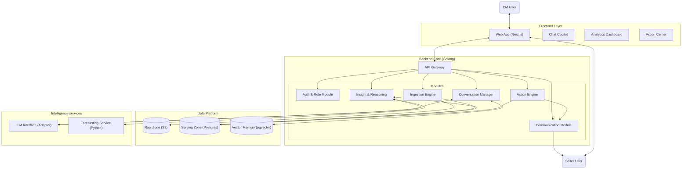
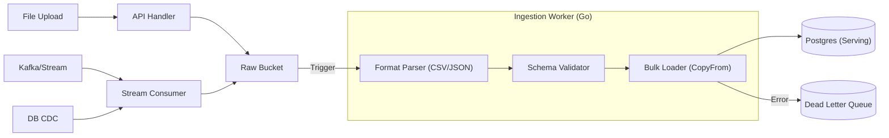
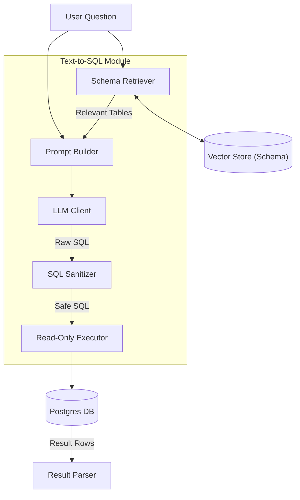
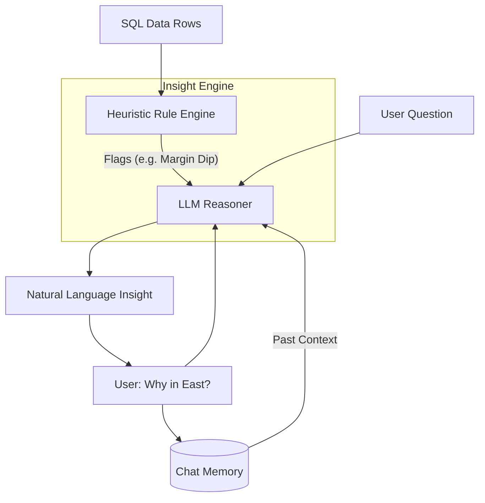
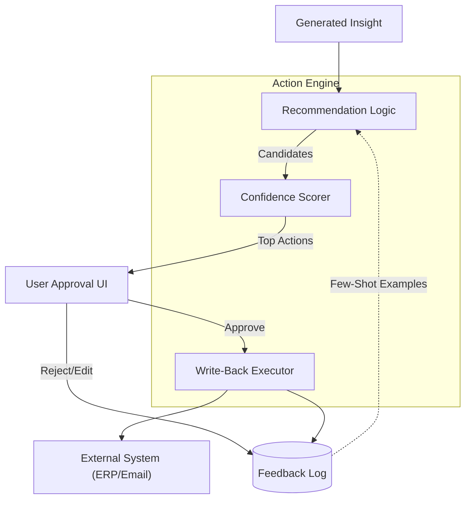
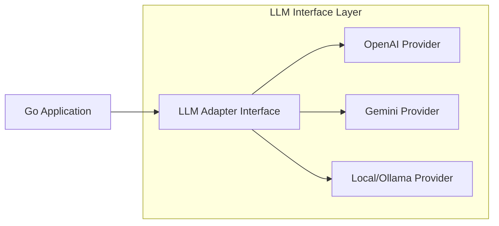

# AI-CM: System Design & Architecture

## 1. High-Level Architecture
The system adopts a **Modular Monolith** architecture to balance performance, simplicity, and future scalability. It uses **Golang** for the backend core, **Next.js** for the frontend, and a **Logical Lakehouse** strategy for data storage.

### 1.1 Architecture Diagram

### 1.2 Core Capabilities Mapping
*   **Ingestion:** Unified multi-source engine.
*   **Conversation:** Text-to-SQL + Insight Reasoning.
*   **Action:** Action Recommendation + Automated Execution (Write-back).
*   **Communication:** Email/Chat integration for Seller/Stakeholder alerts.
*   **Reports:** Downloadable PDF/Excel generation.

---

## 2. Ingestion Module Design
**Goal:** Unified ingestion for Files, APIs, Streams, and CDC.

### 2.1 Architecture Decision: Logical Data Lakehouse
**Decision:** We use **S3 (MinIO)** as the Raw Zone and **PostgreSQL** as the Serving Zone.

**Why Logical Lakehouse (vs. Data Warehouse or Delta Lake)?**
1.  **Versatility for AI:** AI models often need raw, unstructured data (e.g., original CSVs, emails) which Warehouses handle poorly. S3 stores typically anything.
2.  **Cost & Complexity:** Implementing a full Delta Lake (Spark/Databricks) is operationally heavy/expensive for an MVP. Postgres is lightweight and proven.
3.  **Traceability:** The "Raw Zone" acts as an immutable ledger. If we change our parsing logic, we can replay from S3.

**Why not Cassandra/NoSQL?**
*   **Join Complexity:** Retail analysis requires complex `JOINs` (Sales + SKU + Region + Competitor). Cassandra is poor at joins.
*   **Aggregations:** "Sum of GMV per Region" is fast in Postgres (indexed) but slow/hard in Cassandra without pre-aggregation.
*   **Consistency:** We need strong consistency for Inventory management.

### 2.2 Detailed Ingestion Architecture

---

## 3. Conversational Interface (Memory & Vector DB)
**Goal:** Maintain context-aware conversations.

### 3.1 Architecture Decision: Why Vector DB?
We need **pgvector** (Postgres extension) for two reasons:
1.  **Schema RAG:** To find relevant tables for Text-to-SQL ("which table has 'margin'?").
2.  **Long-term Memory:** To recall past insights ("As discussed last week about East India...").

### 3.2 Text-to-SQL Design

### 3.3 Insight Generation & Refinement
**Goal:** Explain "Why" and allow drill-down.

---

## 4. Action Engine & Feedback Loop
**Goal:** Close the loop from Insight -> Action.

### 4.1 Detailed Flow

---

## 5. Communication & Seller Interface
**Goal:** Connect CMs with Sellers.

1.  **Report Generation:**
    *   **Input:** Current Dashboard State / Chat Insight.
    *   **Process:** HTML Template -> `wkhtmltopdf` (Go wrapper) -> PDF.
    *   **Output:** Download Link / Email Attachment.
2.  **Seller Portal:**
    *   **Compliance Alerts:** Action Engine triggers "Email Alert" -> Seller receives Link -> Views specific "Seller View" dashboard in Next.js.
    *   **Feedback:** Seller replies -> Ingestion (Email Webhook) -> Appears in CM's "Inbox".

---

## 6. LLM Interface Design & Selection
**Goal:** Model Agnostic Design.

### 6.1 LLM Architecture

### 6.2 Model Selection Criteria
For this use case (Text-to-SQL + Reasoning), we select a **Hybrid Strategy**:

*   **Primary (Complex tasks):** **GPT-4o / Gemini 1.5 Pro**.
    *   *Why:* Superior reasoning for complex SQL generation and business logic explanation. High context window for schema.
*   **Secondary (Simple tasks/fallback):** **GPT-4o-mini / Gemini Flash**.
    *   *Why:* Fast, cheap, sufficient for summarization or simple Q&A.
*   **Privacy Option:** **Llama 3 (via Groq/Ollama)** if data cannot leave VPC.

---

## 7. Frontend Design (Next.js)
1.  **Layout:**
    *   **Sidebar:** Nav (Dash, Chat, Actions, Sellers).
    *   **Main:** Canvas for Charts/Grids.
    *   **Right Panel:** Chat Copilot (Collapsible).
2.  **State:** `React Query` for server state, `Zustand` for UI state (isChatOpen).
3.  **Components:**
    *   `ChatBubble`: Renders Markdown + Interactive Chart Widgets.
    *   `ActionCard`: "Accept | Reject" buttons with confidence badge.

---
