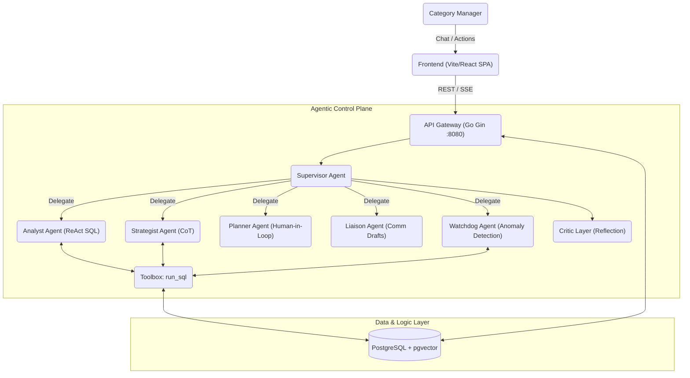
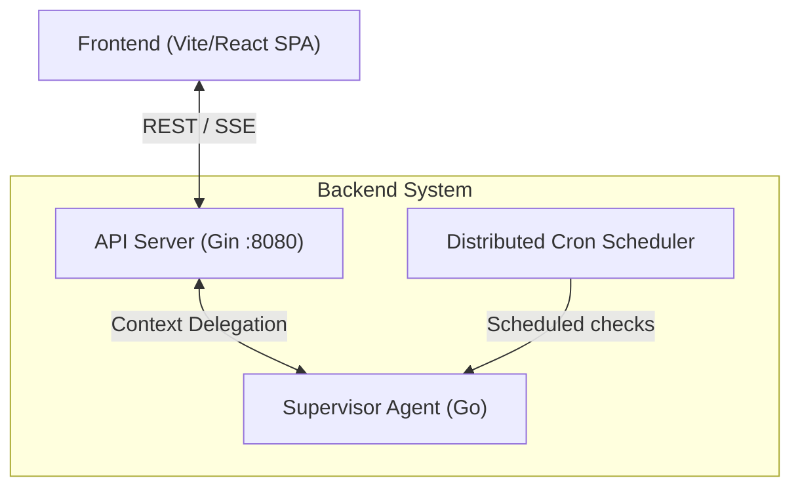
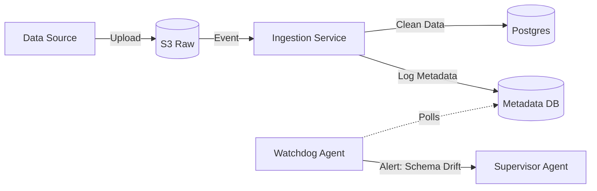
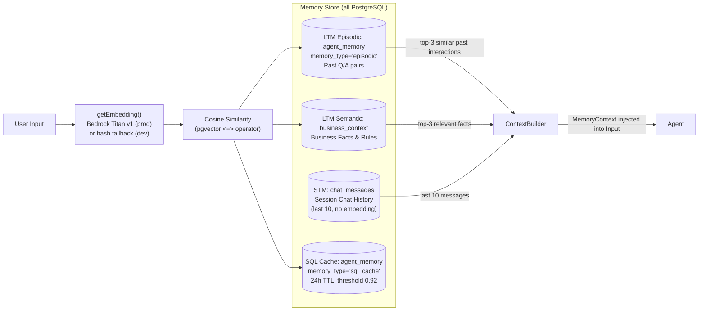
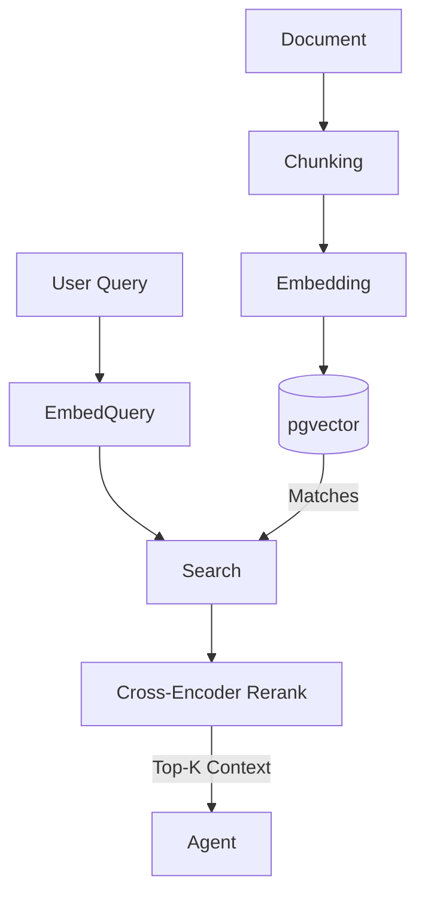
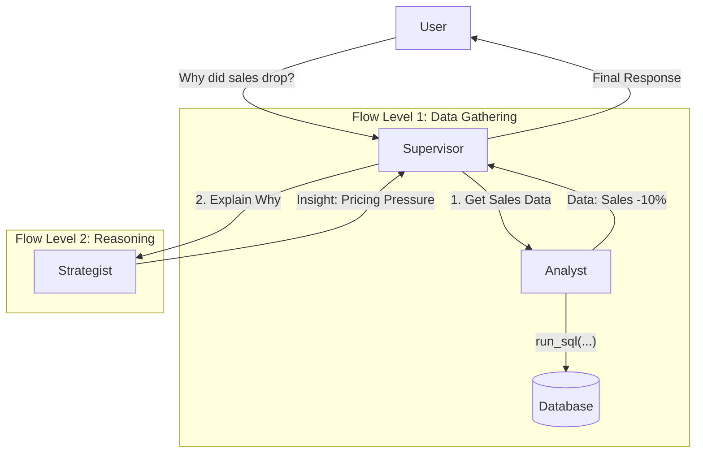
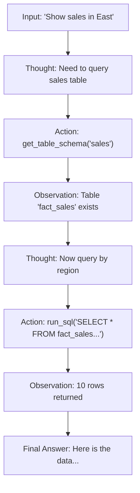
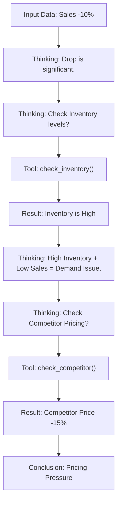
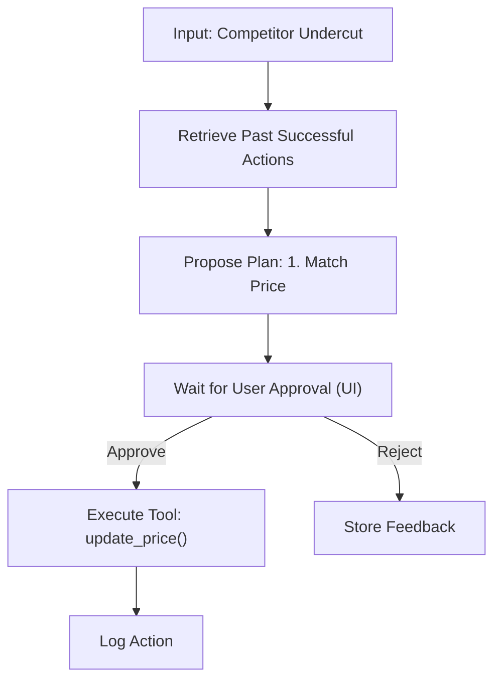

# AI-CM: Agentic System Design

This document details the **Cognitive Architecture** of AI-CM, treating the system as a collaborative team of autonomous agents.

## 1. Why Agentic AI? (vs. Standard GenAI)
Standard LLM implementations (e.g., a simple chatbot wrapper) suffer from hallucinations, inability to execute actions, and lack of rigorous logic. **Agentic AI** solves this by introducing:

1.  **Tool Use & Grounding:** Agents don't just "guess"; they execute SQL, browse documents, and run forecasts. If data is missing, they know they don't know.
2.  **Multi-Step Reasoning:** Complex queries ("Why did margin drop?") require a chain of actions (Get Data -> Check Competitors -> Check Inventory). Single-turn LLMs fail here; Agents persist state through this chain.
3.  **Self-Correction:** If an Agent writes bad SQL, it reads the error message and fixes it (ReAct loop). A standard LLM would just return the error to the user.
4.  **Active Execution:** Agents can *do* things (send emails, update prices) rather than just *say* things, bridging the gap between Insight and Action.

---

## 2. Core Agentic Design Patterns
We utilize specific cognitive patterns to enable autonomous behavior.

### 1.1 Patterns Used
1.  **Orchestrator-Workers (Supervisor Pattern):**
    *   **Usage:** The `SupervisorAgent` manages the session and delegates to `Analyst`, `Strategist`, etc.
    *   **Why:** Prevents "agent confusion" by centralizing state and intent classification.
2.  **ReAct (Reason + Act):**
    *   **Usage:** `AnalystAgent` (Data Retrieval).
    *   **Flow:** Thought -> Action (SQL) -> Observation (Error) -> Thought (Correction) -> Action.
    *   **Why:** Critical for robust SQL generation where first attempts often fail.
3.  **Chain-of-Thought (CoT):**
    *   **Usage:** `StrategistAgent` (Insight).
    *   **Flow:** Step-by-step reasoning ("Sales dropped -> Check Inventory -> Check Competitor -> Conclude").
    *   **Why:** Improves accuracy of "Why" explanations.
4.  **Reflection (Critic):**
    *   **Usage:** `CriticLayer` before Supervisor response.
    *   **Why:** Safety check (e.g., ensuring no PII leaks or hallucinated tables).

---

## 2. High-Level System Architecture
This diagram illustrates how the User, specific Agents, and Data layers interact.



---

## 3. unified Service Architecture

### 3.1 Services Breakdown
The backend is composed of a unified monolithic Go service serving REST APIs and SSE streaming, while encapsulating specialized agent logic.



### 3.2 Key Application Components

| Component Name | Language | Role | Inbound | Dependencies |
| :--- | :--- | :--- | :--- | :--- |
| **API Server** | Go (Gin) | Traffic entry, rate limiting, routing, SSE streaming | HTTP/REST | All agents |
| **Supervisor Agent** | Go | Intent classification, orchestration, 3-tier memory enrichment, Critic post-processing | Internal | Postgres, pgvector, LLM |
| **Analyst Agent** | Go | Text-to-SQL with ReAct loop (3 retries), 2-tier SQL cache | Internal | Postgres, pgvector, LLM |
| **Strategist Agent** | Go | CoT insight generation with parallel SQL context gathering | Internal | Postgres, LLM |
| **Planner Agent** | Go | LLM-generated action proposals → persisted to `action_log` (pending) | Internal | Postgres, LLM |
| **Liaison Agent** | Go | Drafts emails, reports, alerts, summaries using prompt templates | Internal | LLM |
| **Watchdog Agent** | Go | Rule-based anomaly detection (4 checks); saves alerts to DB; cron-triggered | Internal / Cron | Postgres |
| **Critic Layer** | Go | Reflection: PII masking, hallucinated table detection, coherence checks | Internal | — |
| **Recommender** | Go | Rule-based action generation from live DB data (no LLM) | Internal | Postgres |
| **Cron Scheduler** | Go | Distributed DB-locked job scheduler (IntervalJob, DailyJob) | Internal | Postgres |

---

## 4. Ingestion Layer Architecture
**Goal:** Ingest data and alert on anomalies.

### 4.1 Ingestion Flow & Watchdog



---

## 5. Agentic Memory Design
**Goal:** Context Retention & Personalization.

### 5.1 Memory Architecture Diagram



**All 3 tiers are fetched in parallel goroutines** sharing one pre-computed embedding. The SQL cache (L2) is used by the Analyst agent separately before LLM SQL generation.

---

## 6. Detailed RAG Architecture (The Brain)
**Goal:** Retrieve business context (PDFs, Wikis) for Reasoning.

### 6.1 RAG Flow



---

## 7. Inter-Agent Communication (Hub-and-Spoke)
**Pattern:** We use a **Supervisor-Worker** pattern. The Supervisor prevents direct Peer-to-Peer chaos.

### 7.1 Protocol & Flow
*   **Protocol:** Structured JSON over Go Channels (if in-process) or gRPC (if distributed).



---

## 8. Detailed Agent Flows

### 8.1 Data Analyst Agent (ReAct Pattern)


### 8.2 Strategist Agent (Chain-of-Thought)


### 8.3 Action Planner Agent (Human-in-the-Loop)


---

## 9. Code Repository Structure (Monorepo)
```text
ai-cm/
├── src/
│   ├── apps/web/               # Vite + React SPA (TypeScript)
│   │   ├── src/app/            # Page components
│   │   ├── src/components/     # Shared UI components
│   │   ├── src/pages/          # Route pages
│   │   └── package.json
│   │
│   ├── backend/                # Go Backend (monolith)
│   │   ├── cmd/server/         # main.go — server entry point
│   │   └── internal/
│   │       ├── agent/          # All agents + caches (supervisor, analyst, strategist,
│   │       │                   #   planner, liaison, watchdog, critic, recommender,
│   │       │                   #   sql_cache, schema_cache, result_cache, memory_context)
│   │       ├── config/         # YAML + env config
│   │       ├── cron/           # Distributed DB-locked scheduler
│   │       ├── database/       # pgxpool connection setup
│   │       ├── handlers/       # REST handlers (chat, actions, alerts,
│   │       │                   #   dashboard, reports, graphql, suggestions, security)
│   │       ├── llm/            # LLM clients (bedrock, gemini, openai, local/ollama)
│   │       ├── logger/         # slog structured logging
│   │       ├── memory/         # 3-tier memory (interface + PgStore implementation)
│   │       └── prompts/        # Hot-reloadable prompt template loader
│   │
│   └── prompts/                # LLM system prompt .md files
│       ├── analyst_sql.md
│       ├── analyst_summary.md
│       ├── strategist.md
│       ├── planner.md
│       ├── liaison_email.md / liaison_report.md / liaison_slack.md
│       └── chat_suggestions.md
│
├── infra/
│   ├── docker-compose.yml          # Local development
│   ├── docker-compose.prod.yml     # Production (EC2 + RDS, no postgres container)
│   ├── docker-compose.local-llm.yml # Adds Ollama service
│   ├── Dockerfile.backend
│   ├── Dockerfile.frontend         # Vite build → nginx:alpine (port 80)
│   ├── nginx.conf                  # Reverse proxy
│   └── postgres/                   # DB init scripts + seed data
│
├── config/
│   ├── config.prod.yaml
│   └── config.local.yml
│
└── scripts/
    ├── build.sh                    # Build + Docker push
    ├── deploy.sh                   # Pull images + compose up
    └── aws_startstop.sh            # EC2 + RDS start/stop
```
