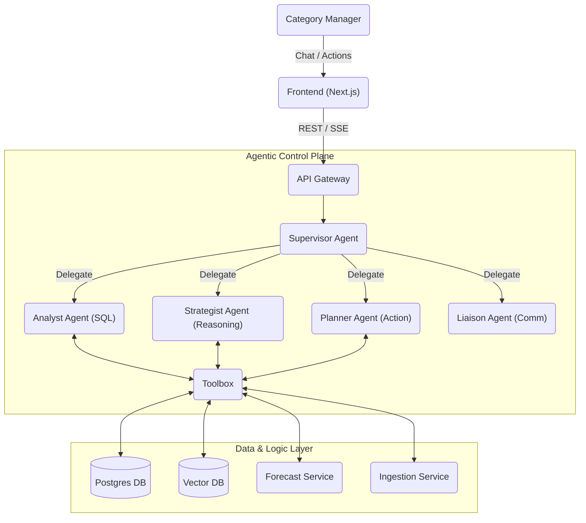
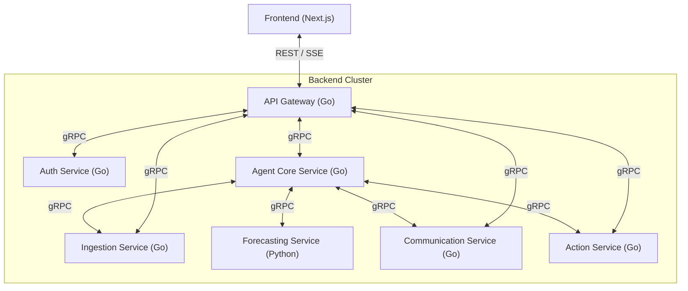
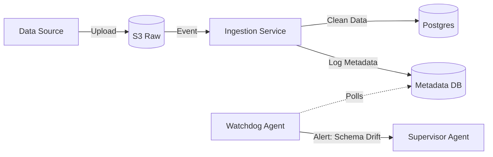
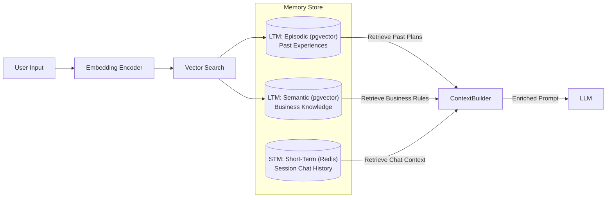
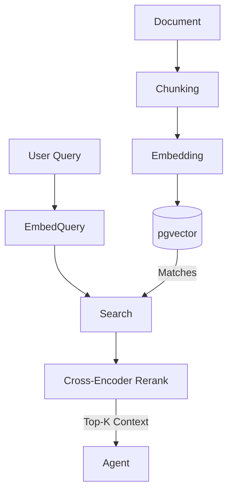
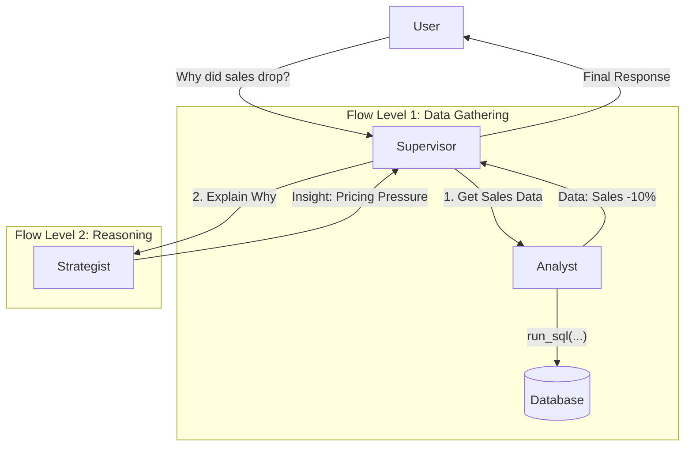
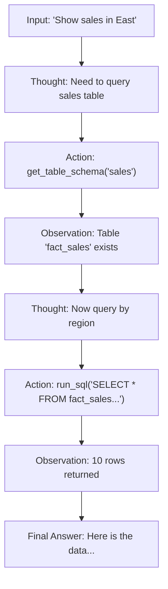
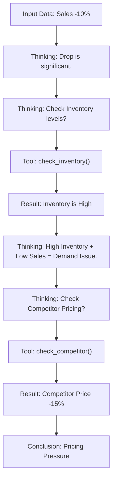
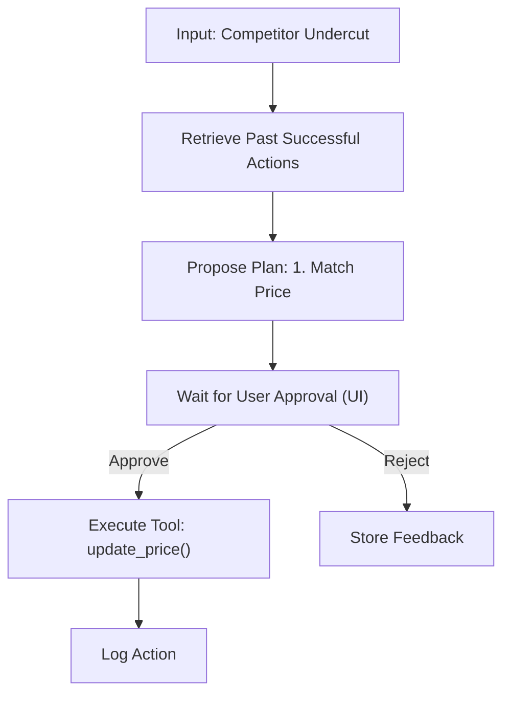

# AI-CM: Agentic System Design

This document details the **Cognitive Architecture** of AI-CM, treating the system as a collaborative team of autonomous agents.

## 1. Why Agentic AI? (vs. Standard GenAI)
Standard LLM implementations (e.g., a simple chatbot wrapper) suffer from hallucinations, inability to execute actions, and lack of rigorous logic. **Agentic AI** solves this by introducing:

1.  **Tool Use & Grounding:** Agents don't just "guess"; they execute SQL, browse documents, and run forecasts. If data is missing, they know they don't know.
2.  **Multi-Step Reasoning:** Complex queries ("Why did margin drop?") require a chain of actions (Get Data -> Check Competitors -> Check Inventory). Single-turn LLMs fail here; Agents persist state through this chain.
3.  **Self-Correction:** If an Agent writes bad SQL, it reads the error message and fixes it (ReAct loop). A standard LLM would just return the error to the user.
4.  **Active Execution:** Agents can *do* things (send emails, update prices) rather than just *say* things, bridging the gap between Insight and Action.

---

## 2. Core Agentic Design Patterns
We utilize specific cognitive patterns to enable autonomous behavior.

### 1.1 Patterns Used
1.  **Orchestrator-Workers (Supervisor Pattern):**
    *   **Usage:** The `SupervisorAgent` manages the session and delegates to `Analyst`, `Strategist`, etc.
    *   **Why:** Prevents "agent confusion" by centralizing state and intent classification.
2.  **ReAct (Reason + Act):**
    *   **Usage:** `AnalystAgent` (Data Retrieval).
    *   **Flow:** Thought -> Action (SQL) -> Observation (Error) -> Thought (Correction) -> Action.
    *   **Why:** Critical for robust SQL generation where first attempts often fail.
3.  **Chain-of-Thought (CoT):**
    *   **Usage:** `StrategistAgent` (Insight).
    *   **Flow:** Step-by-step reasoning ("Sales dropped -> Check Inventory -> Check Competitor -> Conclude").
    *   **Why:** Improves accuracy of "Why" explanations.
4.  **Reflection (Critic):**
    *   **Usage:** `CriticLayer` before Supervisor response.
    *   **Why:** Safety check (e.g., ensuring no PII leaks or hallucinated tables).

---

## 2. High-Level System Architecture
This diagram illustrates how the User, specific Agents, and Data layers interact.



---

## 3. Microservices Architecture

### 3.1 Microservices Breakdown
The backend is composed of high-cohesion, loosely coupled services.



### 3.2 Microservices Inventory

| Service Name | Language | Role | Inbound Protocol | Dependencies |
| :--- | :--- | :--- | :--- | :--- |
| **API Gateway** | Go (Gin) | Traffic Entry, Rate Limiting, Routing, SSE Streaming. | HTTP/REST | All Services |
| **Auth Service** | Go | Identity Provider (OIDC), Token Issuance, RBAC. | gRPC | Postgres (Users) |
| **Agent Core** | Go (LangChain) | Hosting Agent Loops (Supervisor, Analyst, etc.), Tool Execution. | gRPC | Postgres, Vector DB |
| **Ingestion Svc** | Go | Data Parsing (CSV/XLSX), Validation, Bulk Load. | gRPC / S3 Events | Postgres, S3 |
| **Forecast Svc** | Python (FastAPI) | Running ML Models (Prophet, ARIMA) for demand prediction. | gRPC | - |
| **Comm Service** | Go | Sending Emails, Notifications, and PDF Report Generation. | gRPC | SMTP, Templates |
| **Action Svc** | Go | Executing Write-backs (ERP updates), Audit Logging, Approvals. | gRPC | Postgres (Audit) |

---

## 4. Ingestion Layer Architecture
**Goal:** Ingest data and alert on anomalies.

### 4.1 Ingestion Flow & Watchdog



---

## 5. Agentic Memory Design
**Goal:** Context Retention & Personalization.

### 5.1 Memory Architecture Diagram



---

## 6. Detailed RAG Architecture (The Brain)
**Goal:** Retrieve business context (PDFs, Wikis) for Reasoning.

### 6.1 RAG Flow



---

## 7. Inter-Agent Communication (Hub-and-Spoke)
**Pattern:** We use a **Supervisor-Worker** pattern. The Supervisor prevents direct Peer-to-Peer chaos.

### 7.1 Protocol & Flow
*   **Protocol:** Structured JSON over Go Channels (if in-process) or gRPC (if distributed).



---

## 8. Detailed Agent Flows

### 8.1 Data Analyst Agent (ReAct Pattern)


### 8.2 Strategist Agent (Chain-of-Thought)


### 8.3 Action Planner Agent (Human-in-the-Loop)


---

## 9. Code Repository Structure (Monorepo)
```text
ai-cm/
├── apps/
│   ├── web/                    # Next.js Frontend
│   │   ├── src/app/            # App Router
│   │   ├── src/components/     # Shadcn UI
│   │   └── package.json
│
├── backend/                    # Go Backend (Go Workspace)
│   ├── go.work                 # Go Workspace file
│   ├── cmd/                    # Entry points
│   │   ├── gateway/            # main.go for Gateway
│   │   ├── agent-core/         # main.go for Agent Core
│   │   └── ingestion/          # main.go for Ingestion
│   │
│   ├── internal/               # Private shared code
│   │   ├── common/             # Loggers, Errors
│   │   └── proto/              # Generated gRPC stubs (.pb.go)
│   │
│   ├── services/
│   │   ├── auth/               # Auth Service Logic
│   │   ├── agent/              # Agent Logic (Chains, Tools)
│   │   └── ingestion/          # Parsing Logic
│   │
│   └── pkg/                    # Public libraries (if any)
│
├── ml/                         # Python ML Services
│   ├── forecasting/
│   │   ├── app/                # FastAPI app
│   │   └── models/             # Pickle files
│   └── requirements.txt
│
├── infra/                      # Terraform / Docker Compose
│   ├── docker-compose.yml
│   └── postgres/               # Init scripts
│
└── protos/                     # Raw Protocol Buffers
    ├── agent.proto
    └── auth.proto
```
