# AI Category Manager: Low Level Design (LLD)

> For a requirement-by-requirement breakdown of what is built vs. planned (Phase 1 POC vs Phase 2 Production), see the **[Phased Implementation Plan](phased_implementation.md)**.

## 1. High-Level Architecture & Component Boundaries

The AI Category Manager (AI-CM) is structured as a modular Monolith utilizing a highly specialized Agentic architecture interconnected with a Logical Data Lakehouse.

### 1.1 Architectural Overview

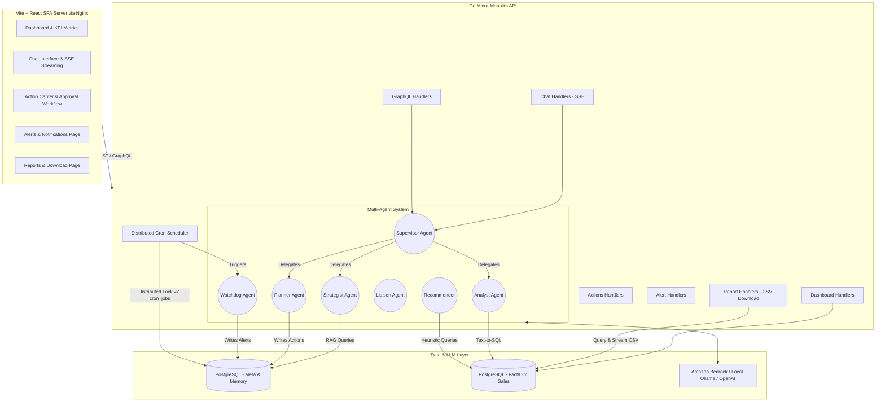

### 1.2 Component Definitions

| Component | Responsibility | Tech Stack |
| :--- | :--- | :--- |
| **Vite/React Frontend** | Manages UI state and renders statically compiled client-side React components. Runs purely in browser, served by lightweight Nginx container. Eliminates Node.js memory overhead, drastically reducing base RAM usage. | React, Vite, TypeScript, Tailwind |
| **Go Handlers** | Serves REST endpoints, validates authentication API keys, executes Rate Limits. | Golang, Gin, pgx |
| **Supervisor Agent** | Classifies incoming chat intent and routes to specialized worker agents. | LangChain-patterns (Go) |
| **Analyst Agent** | Converts natural language definitions into structured Postgres SQL metrics. | ReAct pattern (Go) |
| **Strategist Agent** | Generates reasoning, explanations, and strategic context on data anomalies. | Chain-of-Thought (Go) |
| **Planner Agent** | Emits atomic "Action" objects requiring human approval. | Go Struct Parsing |
| **Watchdog Agent** | Runs threshold-based anomaly detection; persists alerts to DB for display. | Rule-based + Go |
| **Recommender** | Heuristic rules engine that generates action recommendations from inventory/pricing data. | Pure Go, SQL |
| **Distributed Cron** | Node-safe distributed scheduler using DB-level locking for multi-instance safety. | `internal/cron`, pgxpool |
| **Vector Store** | Persists chat history, background context, and system metadata. | PostgreSQL `pgvector` |
| **Data Warehouse** | The Star-Schema database feeding real-time metric aggregates. | PostgreSQL |


## 2. Database Schema Design (Key Tables)
The system relies on PostgreSQL for analytical data, agent memory, and operational logs.

- **`agent_memory` / `business_context`**: Stores pgvector embeddings for RAG (Retrieval-Augmented Generation) memory recall.
- **`action_log`**: Records actions suggested by the Planner, Recommender, or manually created (`id, title, description, action_type, category, confidence_score, status, priority, expected_impact, created_at, updated_at`). `priority` values: `high`, `medium`, `low` (default `medium`). `expected_impact` is a human-readable revenue/risk estimate.
- **`action_comments`**: Stores user comments attached to specific actions, enabling audit trail and collaborative review (`id, action_id, user_name, content, created_at`).
- **`alerts`**: Stores real-time anomalies discovered by the Watchdog agent (`id, title, severity, category, message, acknowledged, created_at, updated_at`). Severity values: `critical`, `warning`, `info`.
- **`cron_jobs`**: Distributed scheduler lock table. Each scheduled job has a row with `id, locked_by, locked_at, last_run, next_run, status`. Prevents duplicate execution across multiple backend instances.
- **`chat_sessions` / `chat_messages`**: Stores conversation history with JSONB metadata column (used to persist follow-up suggestions). Sessions are created on panel open (not on first message); empty sessions are hidden from history.
- **`user_preferences`**: Persists per-user configuration key-value pairs (`id, user_id, key, value, updated_at`). Used by the Config page to save/restore settings across sessions. Unique constraint on `(user_id, key)`.
- **Fact / Dim Tables**: `fact_sales`, `fact_inventory`, `fact_competitor_prices`, `dim_products`, `dim_locations` hold the core retail data.

### 2.1 Schema: cron_jobs

```sql
CREATE TABLE cron_jobs (
    id         VARCHAR(100) PRIMARY KEY,
    locked_by  VARCHAR(100),
    locked_at  TIMESTAMPTZ,
    last_run   TIMESTAMPTZ,
    next_run   TIMESTAMPTZ,
    status     VARCHAR(20) DEFAULT 'idle',
    created_at TIMESTAMPTZ DEFAULT NOW(),
    updated_at TIMESTAMPTZ DEFAULT NOW()
);
```

### 2.2 Schema: action_comments

```sql
CREATE TABLE action_comments (
    id         UUID PRIMARY KEY DEFAULT uuid_generate_v4(),
    action_id  UUID REFERENCES action_log(id) ON DELETE CASCADE,
    user_name  VARCHAR(100) DEFAULT 'demo_user',
    content    TEXT NOT NULL,
    created_at TIMESTAMPTZ DEFAULT NOW()
);
```

### 2.3 Schema: user_preferences

```sql
CREATE TABLE IF NOT EXISTS user_preferences (
    id         UUID PRIMARY KEY DEFAULT uuid_generate_v4(),
    user_id    VARCHAR(100) NOT NULL DEFAULT 'demo_user',
    key        VARCHAR(100) NOT NULL,
    value      TEXT NOT NULL,
    updated_at TIMESTAMPTZ DEFAULT NOW(),
    UNIQUE(user_id, key)
);
```

Accessed via `GET /api/config/preferences` and `PUT /api/config/preferences`. The Config page reads all keys on mount and upserts on save using `ON CONFLICT (user_id, key) DO UPDATE`.

**Migration safety:** Uses `CREATE TABLE IF NOT EXISTS` so re-running schema scripts on an existing DB is safe. Existing deployments should apply `infra/postgres/07-migrate.sql` which also runs `ALTER TABLE action_log ADD COLUMN IF NOT EXISTS priority / expected_impact` with safe defaults.


## 3. Top-Level Agent Breakdown

### 3.1 Supervisor (Orchestrator)
The core controller located at `src/backend/internal/agent/supervisor.go`.
- Relies on few-shot prompting to classify user queries into Intents (`IntentSQL`, `IntentPlan`, `IntentInsight`, `IntentChat`).
- Delegates the request and memory context to the specific worker agent.
- **Clarification gate** (`needsClarification`): fires before LLM intent classification. If the query is an exact bare topic word or a "show me X" pattern with no specifics (e.g., `"sales"`, `"show me inventory"`), returns a structured clarification prompt immediately — no LLM call.
- **Session end episodic memory**: when a chat session is deleted, the first user message and message count are summarised and stored in `agent_memory` as `memory_type='episodic'` via `StoreEpisodicMemory` (non-blocking goroutine).

### 3.2 Watchdog (Anomaly Detection)
- Operates independently or triggered via the Distributed Cron Scheduler (`src/backend/internal/agent/watchdog.go`).
- Queries database thresholds for four anomaly types:
  - **Price Drops** (`price_diff_pct < -10%` against competitor prices)
  - **Stockout Risks** (`days_of_supply < 7 AND qty < reorder_level`)
  - **Sales Anomalies** (week-over-week revenue drop `> 20%`)
  - **Excess Inventory** (`days_of_supply > 90 AND qty > 300`)
- Persists detected anomalies into the `alerts` table using severity `critical`, `warning`, or `info`.
- Supports two execution modes: **interval checks** (every 5 minutes) and **time-based daily alerts** (at 08:00 AM) via the scheduler.

### 3.3 Analyst (Data Retrieval & Text-to-SQL)
- High-reasoning agent utilizing the configured production model (`us.meta.llama3-1-70b-instruct-v1:0` via Amazon Bedrock; `llama3.2` locally via Ollama).
- Executes a **ReAct loop (max 3 retries)**. If a generated SQL query fails, the database error and the exact failing SQL query are passed *back* into the LLM context to self-correct hallucinated schemas or syntax errors.
- Strict read-only output enforcement.

### 3.4 Planner (Action Engine)
- Receives complex strategies and breaks them down into discrete execution steps.
- Outputs JSON conforming to the `action_log` schema, which is parsed and saved to the DB as actionable recommendations.

### 3.5 Recommender (Heuristic Rule Engine)
- Operates without LLM inference; queries the DB directly using business rules.
- Generates up to 5 actions per rule type per invocation (configurable via SQL `LIMIT`):
  - **Price Match**: competitor `price_diff_pct < -5%` in last 7 days
  - **Restock**: `quantity_on_hand < reorder_level AND days_of_supply < 10`
  - **Promotion**: `days_of_supply > 60 AND quantity_on_hand > 200`
- Deduplication: uses `WHERE NOT EXISTS (SELECT 1 FROM action_log WHERE title = $title AND status = 'pending')` to avoid duplicate pending items.

### 3.6 Distributed Cron Scheduler
- Located at `src/backend/internal/cron/scheduler.go`.
- Uses PostgreSQL `cron_jobs` table as a distributed lock mechanism:
  1. On each tick, the scheduler tries to acquire a lock for the job (`UPDATE ... WHERE status = 'idle' OR locked_at < NOW() - INTERVAL '10 minutes'`).
  2. If the lock is acquired, the job handler executes with the job's context.
  3. On completion, the lock is released and `last_run` / `next_run` timestamps are updated.
- Supports two job types:
  - **IntervalJob**: runs every N minutes/seconds (e.g., Watchdog anomaly check every 5 min)
  - **DailyJob**: runs at a specific hour:minute UTC (e.g., Watchdog daily summary at 08:00)
- Gracefully shut down via `scheduler.Stop()` during OS signal handling.


## 4. New Feature Sequence Diagrams

### 4.0 Distributed Cron Scheduler Flow

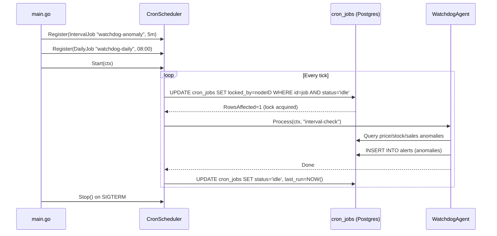

### 4.1 Action Center: View Modes, Details, Comments & Revert Flow

The Action Center supports three view modes selectable via a toggle (**⊞ Grid / ≡ List / ☰ Details**). All modes share the same data source but render differently:
- **Grid**: Responsive `repeat(auto-fill, minmax(340px, 1fr))` card layout — default view for high-level overview.
- **List**: Sortable table with columns for title, type, category, confidence, and status.
- **Details**: Same table with expanded description and timestamp columns.

Sort options: **Newest** (created_at DESC), **Oldest** (created_at ASC), **Updated** (updated_at DESC), **Status** (status grouping).

Both `created_at` and `updated_at` are surfaced in the UI. `updated_at` is shown distinctly when it differs from `created_at`.

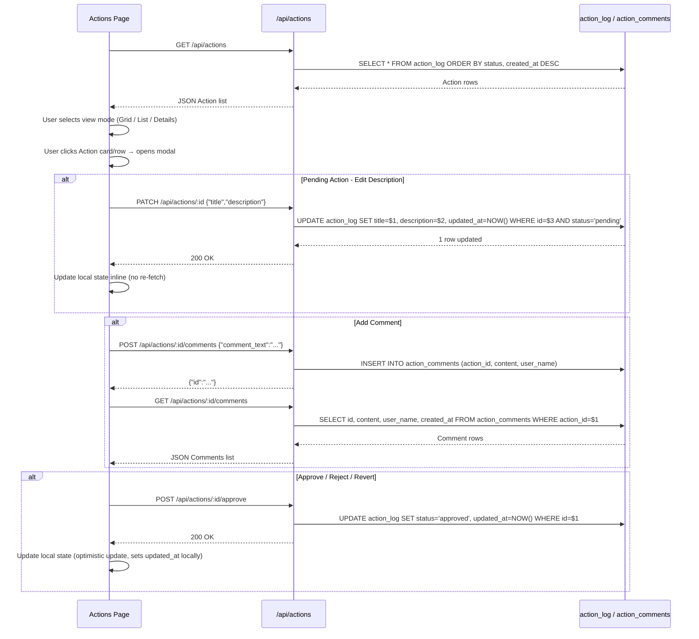

### 4.1a Draft Action with AI Flow

Category Managers can describe an intended action in plain language and have the LLM draft a formal proposal.

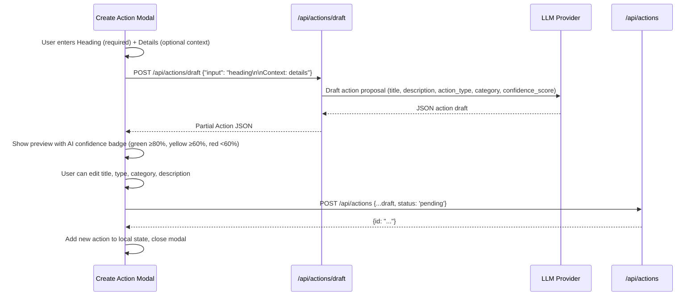

### 4.1b Create Alert from Chat

When a chat suggestion has `type === "action"` and matches `/create.*(an?|the)?\s*alert/i`, the frontend intercepts it and renders an inline form rather than sending the text to the LLM.

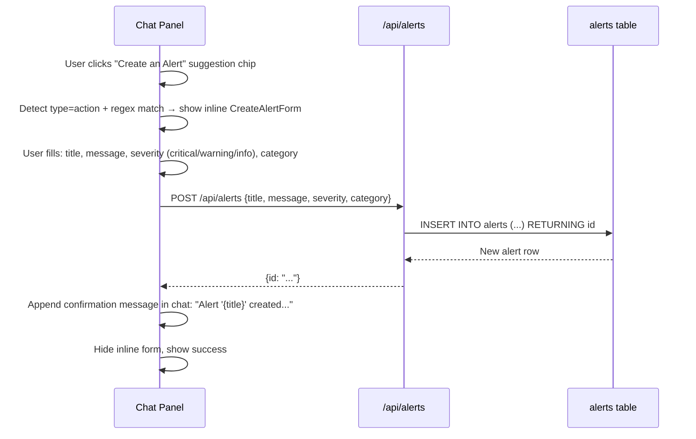

### 4.1c Chat Session Persistence

Chat sessions are persisted to PostgreSQL and restored when the user navigates back to the chat. Sessions are ordered by `updated_at` so recently active conversations float to the top.

**Session lifecycle:**
- A session is created immediately when the chat panel opens (before any message is sent) via `POST /api/chat/sessions`.
- The session history sidebar shows up to the **last 10 sessions** that contain at least one message (empty sessions are filtered out by `EXISTS (SELECT 1 FROM chat_messages WHERE session_id = s.id)`).
- Each session in the sidebar has a **🗑 delete button** that calls `DELETE /api/chat/sessions/:id` (cascades to messages).
- Each chat SSE response includes `confidence_score` and `data_source` fields for display under the assistant message.
- If the SSE connection fails, the message is marked with `isError: true` and a **↻ Retry** button is displayed.

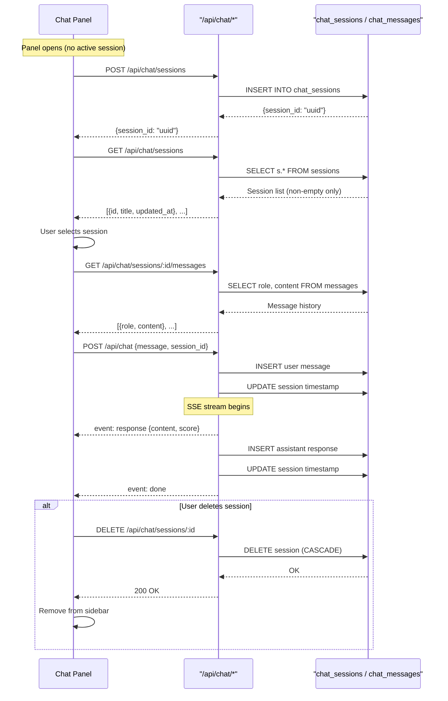

### 4.2 Report Download Flow

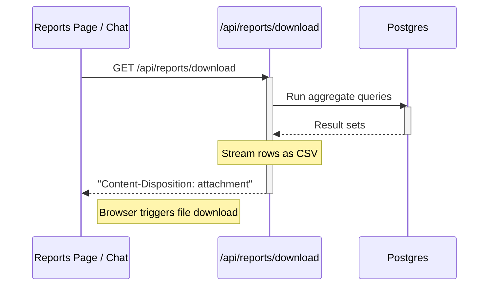

### 4.3 Supervisor Orchestration Flow

The Supervisor implements a six-intent routing table: `IntentQuery`, `IntentInsight`, `IntentPlan`, `IntentCommunicate`, `IntentMonitor`, `IntentGeneral`. A **clarification gate** (`needsClarification`) fires before LLM classification and short-circuits bare topic words (e.g., `"sales"`, `"inventory"`) with a structured clarification response at zero LLM cost.

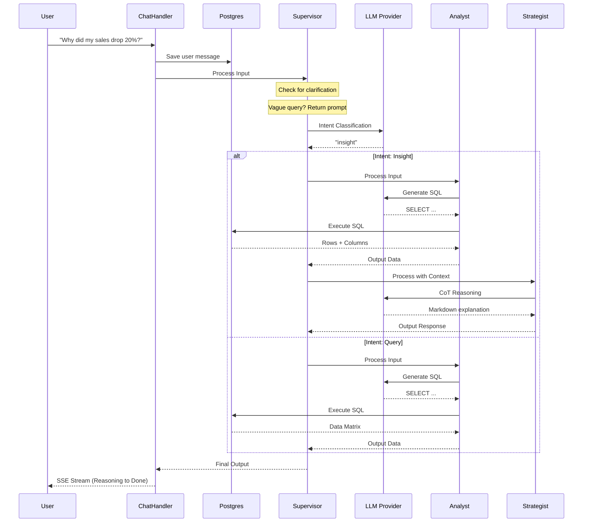

### 4.4 ReAct Pattern: Analyst Agent Workflow

The Analyst heavily utilizes the ReAct pattern to iteratively probe the database without failing outright.

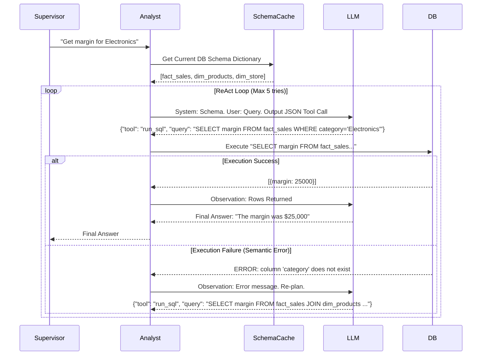


## 5. REST API Reference

### 5.0 Complete Endpoint Map

| Method | Endpoint | Description |
| :--- | :--- | :--- |
| GET | `/api/health` | Health check including DB ping |
| GET | `/api/dashboard/kpis` | Aggregate KPI metrics |
| GET | `/api/dashboard/sales-trend` | Monthly sales trend data |
| GET | `/api/dashboard/category-breakdown` | Revenue by category |
| GET | `/api/dashboard/regional-performance` | Revenue by region |
| GET | `/api/dashboard/top-products` | Top 10 products by revenue |
| POST | `/api/dashboard/explain` | LLM explanation of a dashboard card |
| POST | `/api/chat` | SSE streaming chat (multi-agent) |
| POST | `/api/chat/sessions` | Create new chat session (called on panel open) |
| GET | `/api/chat/sessions` | List last 10 non-empty chat sessions (ordered by updated_at DESC) |
| GET | `/api/chat/sessions/:id/messages` | Get messages for a session (ordered ASC for context) |
| DELETE | `/api/chat/sessions/:id` | Delete a chat session and its messages (CASCADE) |
| GET | `/api/actions` | List actions (optional `?status=` filter) |
| POST | `/api/actions` | Create manual action |
| POST | `/api/actions/generate` | Auto-generate actions via Recommender |
| POST | `/api/actions/draft` | LLM-draft action from natural language |
| **PATCH** | **`/api/actions/:id`** | **Update title/description of pending action** |
| POST | `/api/actions/:id/approve` | Approve action |
| POST | `/api/actions/:id/reject` | Reject action |
| POST | `/api/actions/:id/revert` | Revert approved/rejected action to pending |
| GET | `/api/actions/:id/comments` | Get comments for action |
| POST | `/api/actions/:id/comments` | Add comment to action |
| GET | `/api/alerts` | List all alerts |
| POST | `/api/alerts/:id/acknowledge` | Acknowledge an alert |
| **GET** | **`/api/reports/download`** | **Download CSV report (streams response)** |
| GET | `/api/config/preferences` | Get all user preference key-value pairs |
| PUT | `/api/config/preferences` | Save/upsert user preference key-value pairs |
| POST | `/api/graphql` | GraphQL endpoint (chat suggestions, etc.) |

## 6. API Sequence Diagrams

These diagrams map out the system boundaries for the REST layer, handling connections between the frontend, Go webserver, and underlying PostgreSQL layers.

### 6.1 Server-Sent Events (SSE) Chat Endpoint

`/api/chat` utilizes Server-Sent Events to keep the connection open while the LangChain Go agents stream tokens.

**Important:** All consumers of SSE endpoints (including the Dashboard's "Recommend Actions" feature) must use a streaming reader (not `await res.text()` which buffers the full response). The frontend uses `ReadableStream` + `TextDecoder` with an `AbortController` (45-second timeout) to parse `data:` lines incrementally.

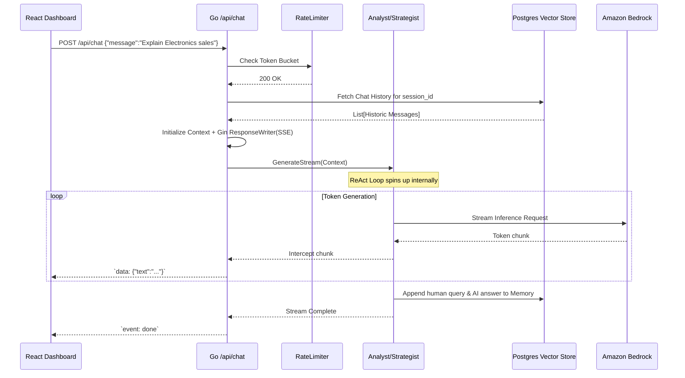

### 6.2 Dashboard Aggregation Endpoints 

The dashboard UI makes several high-concurrency requests upon pageload.

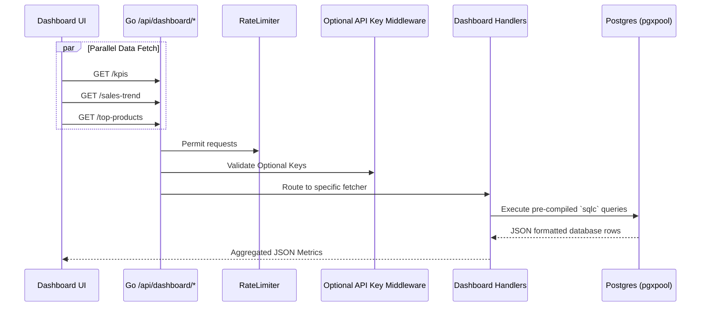


## 7. Agent Data Flow & Context Pipeline

To prevent hallucination in SQL generation, AI-CM employs an in-memory `SchemaCache` overlaid with persistent `pgvector` memory embeddings.

### 7.1 Schema Caching & DDL Context

LLMs require specific schema maps to translate text to SQL accurately.

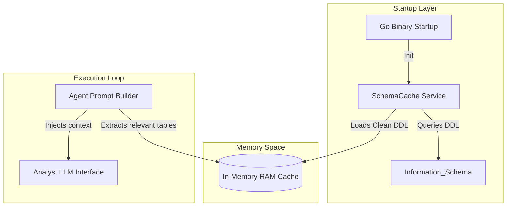

### 7.2 Strategist Data Flow (RAG)

When users ask strategic questions, the system checks past actions and alerts using vector search.

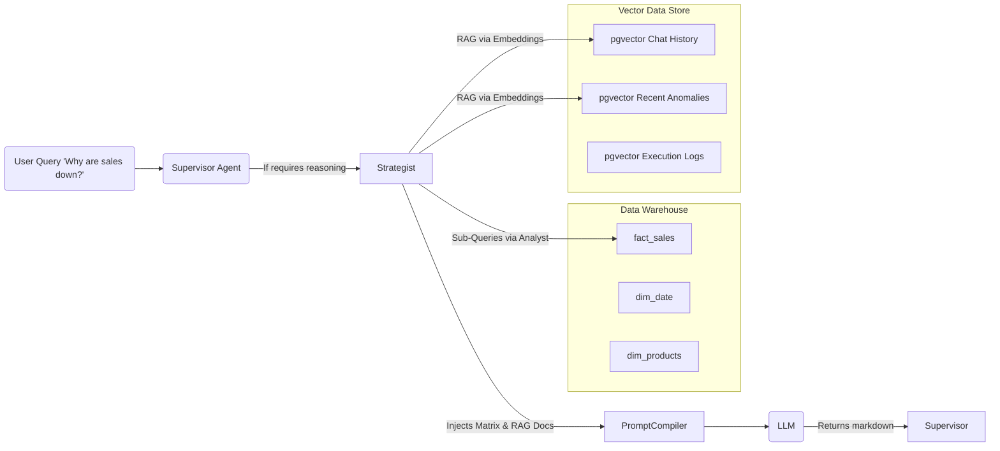

### 7.3 Table Definitions Loaded into SchemaCache

The backend specifically isolates these tables into the cache to define the semantic boundary the Analyst LLM can see:

1. **fact_sales:** Transactional metrics `margin, revenue, units, sale_date, location_id, product_id`
2. **fact_inventory:** Stock levels `quantity_on_hand, reorder_level, days_of_supply, stock_date`
3. **fact_competitor_prices:** Competitor pricing `competitor_name, competitor_price, price_diff_pct, price_date`
4. **fact_forecasts:** Demand forecasts `predicted_quantity, predicted_revenue, confidence_score, forecast_date`
5. **dim_products:** Taxonomies `category, sub_category, brand, mrp, cost_price, sku, status`
6. **dim_locations:** Geographic metadata `city, state, region` (30 cities, 4 regions: North/South/East/West)

This allows prompts to specifically block unauthorized access to other schema tables (like `users` or `system_logs`).


## 8. Subsystem: Deep Episodic Memory (PgVector)
Rather than blindly stuffing conversational arrays back into the LLM context limits, the platform relies on **Contextual Memory Retrieval** through Semantic Indexing.

- **Storage Hook (per-message)**: After each successful LLM response, the assistant message is stored asynchronously in `agent_memory` (type `episodic`) with its embedding via `supervisor.StoreEpisodicMemory()` goroutine.
- **Storage Hook (session end)**: When a chat session is explicitly deleted (`DELETE /api/chat/sessions/:id`), the handler fetches the session's first user message and total message count, then stores a session summary record in `agent_memory` before deletion — enabling future RAG retrieval of past session topics.
- **Embedding Generation**: `getEmbedding()` calls `llm.Embedder` (Bedrock Titan v1 in production, 1536 dims). The embedding is computed **once per query** and reused across all three parallel memory lookups.
- **3-Tier Memory**: STM (last 10 `chat_messages`, no vector), LTM Episodic (`agent_memory`, past Q/A pairs), LTM Semantic (`business_context`, business rules and facts).
- **Retrieval Engine**: `BuildContext()` runs three cosine-similarity queries in parallel goroutines, returning top-3 results from each tier, then injects the combined context into the agent prompt.
- **SQL Cache (L2)**: Analyst agent uses a separate vector search on `agent_memory` (type `sql_cache`) with a similarity threshold of ≥ 0.92 and 24-hour TTL to retrieve previously generated SQL for semantically equivalent queries.
- **Business Context Seeding**: `business_context` facts are seeded via `infra/postgres/*.sql` with pre-computed embeddings. A document ingestion pipeline (Phase 2) will allow loading PDFs and wikis dynamically.

For the full RAG architecture diagram and embedding model details, see **[Agentic Architecture § 6](design_agent.md#6-detailed-rag-architecture-the-brain)**.

## 9. Security & Rate Limiting Controls
- **API Key Auth**: Secured via custom Gin middleware leveraging `API_KEYS` env variable. Bearer Token required for programmatic API consumption.
- **Rate Limiting**: IP-based rate limiting via `x/time/rate`, restricting endpoint spam (`RATE_LIMIT_PER_MINUTE`).
- **Postgres RBAC**: The LLM queries data using a restricted logical user (`aicm`) to eliminate SQL injection threat risks for destructive operations.


## 10. AWS Production Deployment Architecture

### 10.1 Infrastructure Overview

The production deployment runs entirely on AWS using Graviton2 (ARM64) instances. All application containers run on a single EC2 node; the database is managed by RDS. LLM inference is offloaded to Amazon Bedrock in `us-east-1` via cross-region inference profiles.

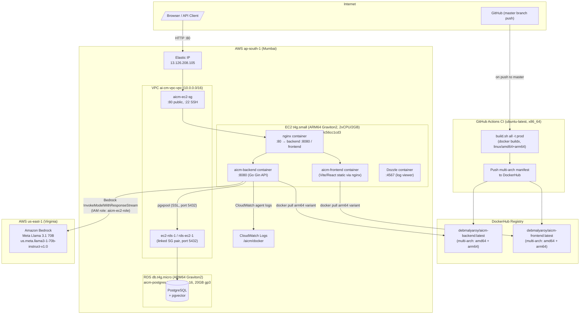

### 10.2 Two-Region Setup

The deployment intentionally spans two AWS regions for different purposes:

| Region | Services | Config Key |
|---|---|---|
| `ap-south-1` (Mumbai) | EC2, RDS, VPC, CloudWatch | `AWS_REGION` in `.env [prod.aws]` |
| `us-east-1` (Virginia) | Amazon Bedrock (Llama models) | `llm.aws_region` in `config/config.prod.yaml` |

The EC2 instance's IAM role (`aicm-ec2-role`) carries `bedrock:InvokeModel` permission scoped to the specific Llama 3.1 70B foundation model ARN in `us-east-1`. No static credentials are stored on the instance.

### 10.3 Multi-Arch Docker Build Pipeline

The CI job (`ci.yml`) runs on GitHub-hosted `ubuntu-latest` (x86_64) but **produces images for both `linux/amd64` and `linux/arm64`** using Docker Buildx with the `docker-container` driver.

```
build.sh all -t prod
  └─ docker buildx build --platform linux/amd64,linux/arm64
        ├─ infra/Dockerfile.backend  →  debmalyaroy/aicm-backend:latest
        └─ infra/Dockerfile.frontend →  debmalyaroy/aicm-frontend:latest
```

Both images are pushed as a **multi-arch manifest** to DockerHub. When the EC2 instance (`t4g.small`, ARM64) runs `docker pull`, the Docker daemon automatically selects the `linux/arm64` layer from the manifest — no manual platform flag is needed on the server.

The Go backend binary is also cross-compiled for both architectures in the same build step:
```bash
CGO_ENABLED=0 GOOS=linux GOARCH=amd64 go build -o bin/aicm-server-amd64 ./cmd/server
CGO_ENABLED=0 GOOS=linux GOARCH=arm64 go build -o bin/aicm-server-arm64 ./cmd/server
```

> **Local builds** (`build.sh docker` without `-t prod`) build only the native host architecture and load the image into the local Docker daemon. Multi-arch push always requires `-t prod` and valid DockerHub credentials.

### 10.4 Security Groups

Four security groups control network access:

| SG Name | Attached To | Inbound Rules | Purpose |
|---|---|---|---|
| `aicm-ec2-sg` | EC2 | `:80` (0.0.0.0/0), `:22` SSH (0.0.0.0/0) | Public HTTP + SSH access |
| `ec2-rds-1` | EC2 | — | Outbound side of EC2↔RDS linked pair |
| `rds-ec2-1` | RDS | `:5432` from `ec2-rds-1` | RDS accepts connections from EC2 only |
| `aicm-rds-sg` | RDS | `:5432` from local IP (temp) | Added during initial DB seed; remove after setup |

> The `ec2-rds-1` / `rds-ec2-1` linked pair is created automatically by the RDS Console **"Set up EC2 connection"** wizard — no manual SG rule authoring required.

### 10.5 Deployment Flow (Updating Production)

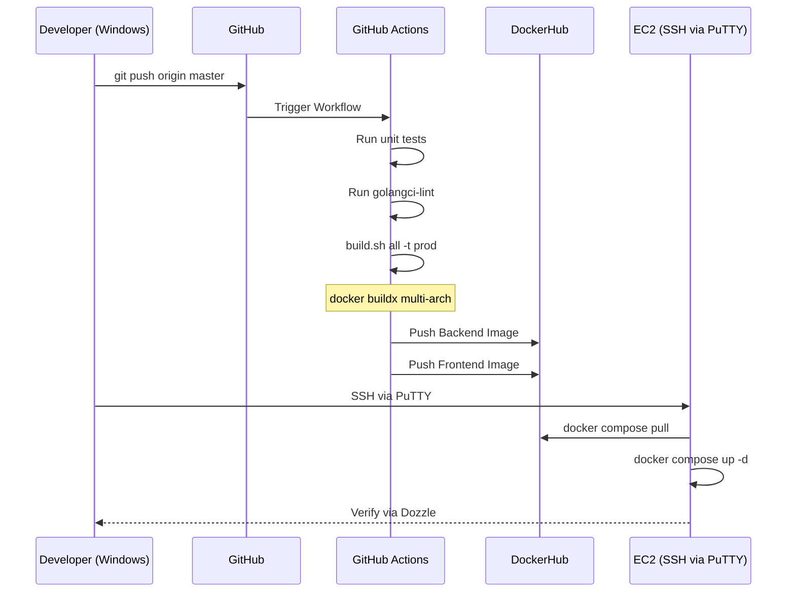
