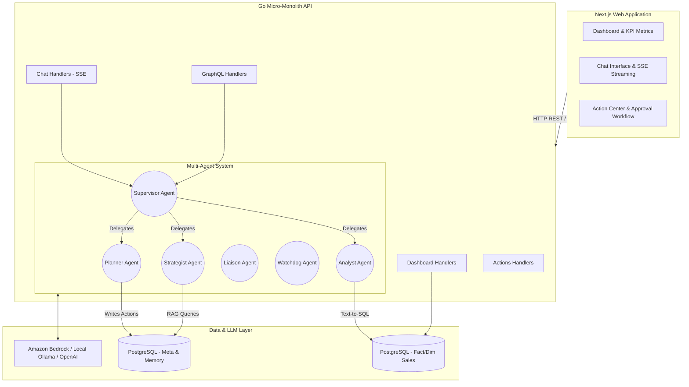
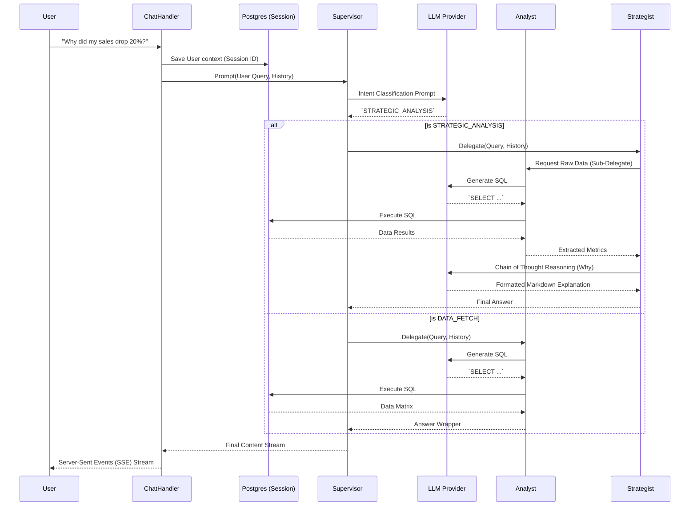
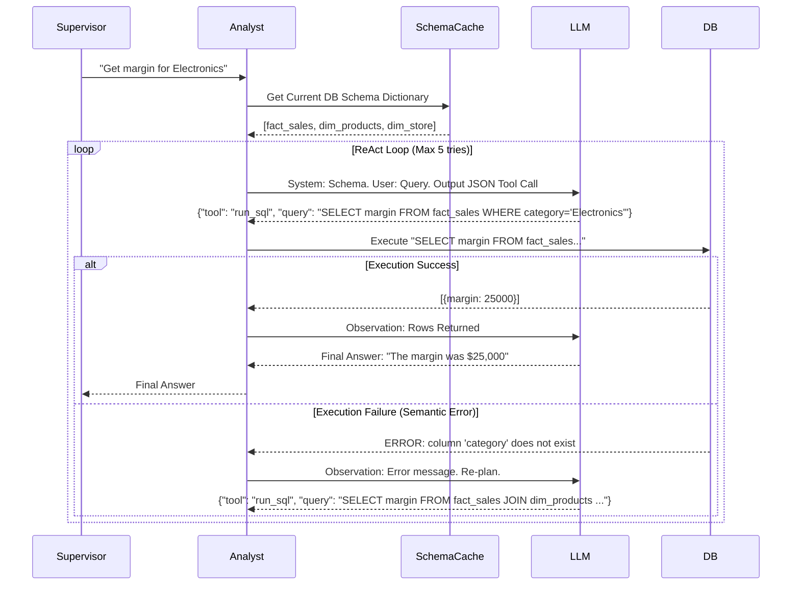
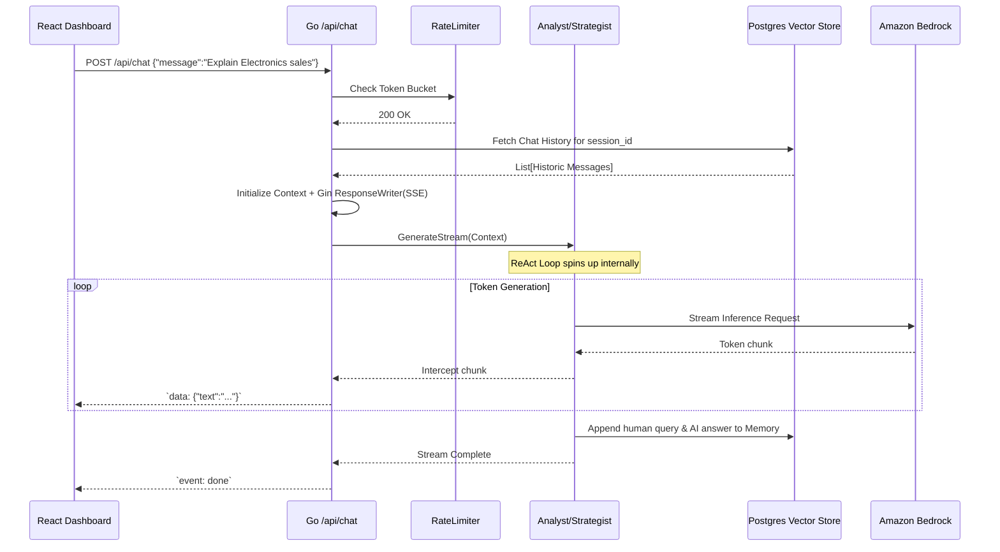
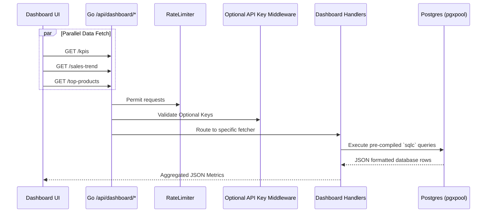
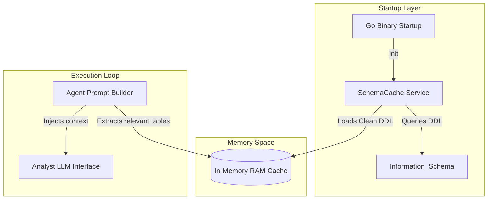

# AI Category Manager: Low Level Design (LLD)

## 1. High-Level Architecture & Component Boundaries

The AI Category Manager (AI-CM) is structured as a modular Monolith utilizing a highly specialized Agentic architecture interconnected with a Logical Data Lakehouse.

### 1.1 Architectural Overview



### 1.2 Component Definitions

| Component | Responsibility | Tech Stack |
| :--- | :--- | :--- |
| **Next.js Frontend** | Manages UI state, renders Server Components for fast loading, handles SSE parsing. | React, TypeScript, Tailwind |
| **Go Handlers** | Serves REST endpoints, validates authentication API keys, executes Rate Limits. | Golang, Gin, pgx |
| **Supervisor Agent** | Classifies incoming chat intent and routes to specialized worker agents. | LangChain-patterns (Go) |
| **Analyst Agent** | Converts natural language definitions into structured Postgres SQL metrics. | ReAct pattern (Go) |
| **Strategist Agent** | Generates reasoning, explanations, and strategic context on data anomalies. | Chain-of-Thought (Go) |
| **Planner Agent** | Emits atomic "Action" objects requiring human approval. | Go Struct Parsing |
| **Vector Store** | Persists chat history, background context, and system metadata. | PostgreSQL `pgvector` |
| **Data Warehouse** | The Star-Schema database feeding real-time metric aggregates. | PostgreSQL |


## 2. Database Schema Design (Key Tables)
The system relies on PostgreSQL for analytical data, agent memory, and operational logs.

- **`chat_memory_embeddings`**: Stores pgvector embeddings of `[user_query, assistant_response]` for RAG (Retrieval-Augmented Generation) memory recall.
- **`action_log`**: Records actions suggested by the Planner and manually executed by the user from the dashboard drill downs (`id, title, description, action_type, category, metadata, confidence_score, status, executed_at`).
- **`alerts`**: Stores real-time anomalies discovered by the Watchdog agent (`id, title, severity, category, message, acknowledged, created_at`).
- **Fact / Dim Tables**: `fact_sales`, `fact_inventory`, `dim_products`, `dim_locations` hold the core retail data accessible by the Analyst agent.


## 3. Top-Level Agent Breakdown

### 3.1 Supervisor (Orchestrator)
The core controller located at `src/backend/internal/agent/supervisor.go`. 
- Relies on few-shot prompting to classify user queries into Intents (`IntentSQL`, `IntentPlan`, `IntentInsight`, `IntentChat`).
- Delegates the request and memory context to the specific worker agent.

### 3.2 Watchdog (Anomaly Detection)
- Operates independently or triggered via system health checks (`src/backend/internal/agent/watchdog.go`).
- Queries database thresholds for: **Price Drops**, **Stockout Risks**, **Sales Anomalies**, and **Excess Inventory**.
- Persists expected anomalies into the `alerts` database table, enabling the frontend Dashboard / Alerts page to display them.

### 3.3 Analyst (Data Retrieval & Text-to-SQL)
- High-reasoning agent utilizing the smartest configured model (e.g., `gpt-4o` or `claude-3-5-sonnet`).
- Executes a **ReAct loop (max 3 retries)**. If a generated SQL query fails, the database error and the exact failing SQL query are passed *back* into the LLM context to self-correct hallucinated schemas or syntax errors.
- Strict read-only output enforcement.

### 3.4 Planner (Action Engine)
- Receives complex strategies and breaks them down into discrete execution steps.
- Outputs JSON conforming to the `action_log` schema, which is parsed and saved to the DB as actionable recommendations.


## 4. Agent Sequence Diagrams

The Cognitive Layer is driven by a master Supervisor agent routing to highly specialized Sub-Agents.

### 4.1 Supervisor Orchestration Flow



### 4.2 ReAct Pattern: Analyst Agent Workflow

The Analyst heavily utilizes the ReAct pattern to iteratively probe the database without failing outright.




## 5. API Sequence Diagrams

These diagrams map out the system boundaries for the REST layer, handling connections between the frontend, Go webserver, and underlying PostgreSQL layers.

### 5.1 Server-Sent Events (SSE) Chat Endpoint

`/api/chat` utilizes Server-Sent Events to keep the connection open while the LangChain Go agents stream tokens.



### 5.2 Dashboard Aggregation Endpoints 

The dashboard UI makes several high-concurrency requests upon pageload.




## 6. Agent Data Flow & Context Pipeline

To prevent hallucination in SQL generation, AI-CM employs an in-memory `SchemaCache` overlaid with persistent `pgvector` memory embeddings.

### 6.1 Schema Caching & DDL Context

LLMs require specific schema maps to translate text to SQL accurately.



### 6.2 Strategist Data Flow (RAG)

When users ask strategic questions, the system checks past actions and alerts using vector search.

```mermaid
graph LR
    User(User Query "Why are sales down?") --> Router(Supervisor Agent)
    Router -->|If requires reasoning| Strategist
    
    subgraph Data Warehouse
        Fact_Sales[fact_sales]
        Dim_Date[dim_date]
        Dim_Products[dim_products]
    end
    
    subgraph Vector Data Store
        Memory[pgvector Chat History]
        Alerts[pgvector Recent Anomalies]
        Actions[pgvector Execution Logs]
    end
    
    Strategist -->|Sub-Queries via Analyst| Fact_Sales
    Strategist -->|RAG via Embeddings| Memory
    Strategist -->|RAG via Embeddings| Alerts
    
    Strategist -->|"Injects Matrix & RAG Docs"| PromptCompiler
    PromptCompiler --> Bedrock(LLM)
    Bedrock -->|Returns markdown| Supervisor
```

### 6.3 Table Definitions Loaded into SchemaCache

The backend specifically isolates these tables into the cache to define the semantic boundary the Analyst LLM can see:

1. **fact_sales:** Transactional metrics `margin, revenue, units, date_id, store_id, product_id`
2. **dim_products:** Taxonomies `category, brand, line, sku`
3. **dim_date:** Temporal metadata
4. **dim_stores:** Geographic metadata `region, city, manager`

This allows prompts to specifically block unauthorized access to other schema tables (like `users` or `system_logs`).


## 7. Subsystem: Deep Episodic Memory (PgVector)
Rather than blindly stuffing conversational arrays back into the LLM context limits, the platform relies on **Contextual Memory Retrieval** through Semantic Indexing.

- **Storage Hook**: Handlers fire an asynchronous storage event after an LLM successfully responds to the user.
- **Embedding Generation**: It leverages `llmClient.Embed(query + response)` to convert textual meaning into dense float vectors.
- **Retrieval Engine**: By querying `memory.GetRelevant()`, the system calculates vector offsets returning the top 3 most "historically similar" QA pairs.

## 8. Security & Rate Limiting Controls
- **API Key Auth**: Secured via custom Gin middleware leveraging `API_KEYS` env variable. Bearer Token required for programmatic API consumption.
- **Rate Limiting**: IP-based rate limiting via `x/time/rate`, restricting endpoint spam (`RATE_LIMIT_PER_MINUTE`).
- **Postgres RBAC**: The LLM queries data using a restricted logical user (`aicm`) to eliminate SQL injection threat risks for destructive operations.
