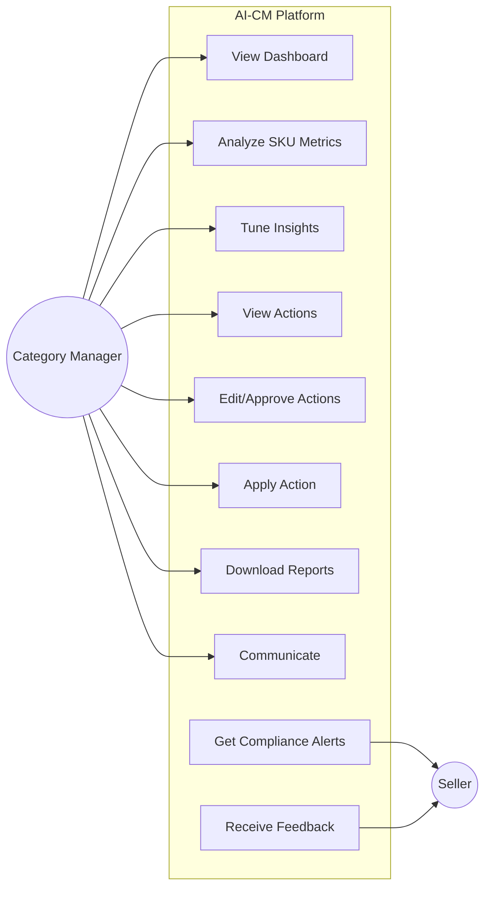

# AI-CM: AI Category Manager Copilot

## 1. Problem Context

Category Managers (CMs) play a critical operational and commercial role in retail and e-commerce. They own the end-to-end performance of a product category—assortment, pricing, inventory availability, promotions, seller compliance, and customer experience.

In large and complex markets like **Bharat**, category management is especially challenging due to:

* High regional demand fragmentation
* Strong price sensitivity
* Large SKU catalogs across multiple sellers
* Operational constraints in supply chain and fulfillment

Their decisions directly impact:

* Sales revenue (GMV)
* Category margins
* Inventory health
* Customer satisfaction and retention

---

## 2. Core Problem

Despite being data-rich, most Category Managers are **insight-poor**.

Today, Category Managers spend **45–60% of their working hours (≈50–55 hours/week)** on:

* Manual data extraction from multiple dashboards and tools
* Interpreting siloed reports
* Creating presentations and review decks
* Explaining past performance instead of acting on future opportunities

### Resulting Challenges

* Decisions are reactive, not predictive
* High decision latency leads to missed opportunities
* Limited time for strategic thinking
* Customer experience issues are detected too late

---

## 3. Existing Solutions & Gaps

Current enterprise solutions (e.g., demand forecasting, pricing intelligence, replenishment systems, analytics tools) solve **individual problems well**, but:

* They are **discrete and siloed**
* They require heavy manual interpretation
* They are analyst-driven, not CM-native

There is **no single platform** that provides a Category Manager with an **end-to-end, lifecycle view of a category and its SKUs**.

---

## 4. Proposed Solution: AI-CM

**AI-CM** is an AI-powered copilot designed specifically for Category Managers.

It acts as a **decision intelligence platform**, not just a dashboard or chatbot.

AI-CM provides:

* Consolidate insight across assortment, pricing, inventory, demand and customer feedback
* End-to-end visibility of category and SKU lifecycle
* Predictive and prescriptive insights
* Natural language interaction for continuous refinement
* Explain and recommend clear next action at the SKU and category level
* Seamless integration with operational workflows

---

## 5. What Makes AI-CM Different

### Key Differentiators

* **End-to-end category lifecycle view**: from SKU onboarding to sales impact and customer feedback
* **AI-first architecture**: forecasting, anomaly detection, recommendations, and learning loops
* **LLM-powered reasoning layer**: explains *why* something happened, not just *what*
* **CM-native workflows**: built around daily operational tasks, not analyst reports

AI-CM transforms category management from **reactive analysis** to **proactive decision intelligence**.

---

## 6. How AI-CM Solves the Problem

### The AI-CM Loop: Ask → Query → Insight → Action

AI-CM fundamentally changes the workflow from "Manual Data Gathering" to "Conversational Problem Solving" via a dedicated **Text-to-SQL Intelligence Layer**. With **LLM assisted insight generation and action recommendation**, CMs can make more informed, accurate and faster decisions.

**Data Ingestion:**

Gather data from different data sources: API, file, webhooks, CDC, streams, emails, messages, etc.

**The New Workflow:**

1.  **Ask:** CM asks a natural language question (e.g., "Why did margin drop in East India last week?").
2.  **Query Generation:** The LLM understands the business intent and schema, generating a precise, secure SQL query.
3.  **Data Retrieval:** AI-CM executes the query against the enterprise database to fetch category, sub category and SKU insights.
4.  **Insight & Conversation:** The system analyzes the result, explains the "Why" (e.g., "Competitor X dropped prices"), and initiates a conversation for follow-up actions.
5.  **Action:** The system provides a list of recommended actions based on the insights.
6.  **Action Execution (_Optional_):** The system executes the recommended actions (with human in loop or automated)
7.  **Feedback Loop:** The system learns and iterate to improve the insights and recommendations based on the feedback from the CM.

**Example:**

CM: "Why did margin drop in East India last week?"

AI-CM: "Margin dropped by 5% in East India last week due to a 10% price drop by Competitor X in the electronics category."

CM: "What should I do?"

AI-CM: "You can either match Competitor X's price or increase marketing spend by 15% to maintain market share."

CM: "Match Competitor X's price."

AI-CM: "Price updated successfully."

### Detailed Use Cases

| Use Case | Description | Primary Actor |
| :--- | :--- | :--- |
| **View category dashboard** | View high-level metrics (GMV, Margin, Inventory) and health of the category. | Category Manager |
| **Analyze SKU metrics and revenue impact** | Drill down into specific SKUs to understand performance drivers and revenue implications. | Category Manager |
| **Tune insights and get decisions** | Interact with AI to refine parameters (e.g., "What if price drops 5%?") and get tailored decisions. | Category Manager |
| **View recommended actions** | See a prioritized list of AI-suggested actions (e.g., "Restock SKU X", "Drop Price on Y"). | Category Manager |
| **Edit and approve recommended actions** | Review AI suggestions, modify details if needed, and give final approval for execution. | Category Manager |
| **Apply recommended action** | Execute the approved action directly through the platform (e.g., push price update to ERP). | Category Manager |
| **Download reports and raise issues** | Export insights to PDF/Excel or flag data discrepancies for resolution. | Category Manager |
| **Communicate via email or chat** | Send insights or instructions to stakeholders/sellers directly from the AI-CM interface. | Category Manager |
| **Get compliance alerts** | Receive notifications about policy violations (e.g., pricing parity, stockouts). | Seller |
| **Receieve feedback alerts** | Get performance feedback and improvement suggestions from the category manager. | Seller |

### Core Capabilities

*   **Unified Data Ingestion:** Seamlessly ingest data from Files, APIs, Streams, and CDC.
*   **Text-to-SQL Engine:** Convert natural language questions into precise SQL queries to fetch raw data.
*   **Insight Generation & Reasoning:** Analyze retrieved data to explain trends, identify root causes, and provide business context.
*   **Predictive & Diagnostic Analytics:** Forecasting (Time-series), Anomaly Detection (Deviations), and Root Cause Analysis ("Why it happened").
*   **Prescriptive Action Engine:** Generate prioritized, actionable recommendations with confidence scores.
*   **Automated Execution:** Write-back capabilities to apply decisions (e.g., Price updates) directly to operational systems.
*   **Continuous Learning:** Feedback loops to improve recommendation accuracy over time.

### Conversational Intelligence

* LLM-based interface where CMs can ask follow-up questions
* Continuous refinement of insights through natural language
* Scenario simulation ("What if I reduce price by 5%?")

---

## 7. Operational Impact (Cycle Time Savings)

**Industry-standard benchmarks** indicate:

### Large Enterprise

* Data analysis time reduced by **60–70%**
* Faster decision cycles by **3–5 days**
* Higher forecast accuracy and margin protection

### Mid-Size Company

* Analysis effort reduced by **50–60%**
* Improved agility in pricing and assortment decisions

### Small Company

* Near-elimination of manual reporting
* Access to enterprise-grade intelligence with minimal teams

---

## 8. Example Retail Use Case

* Sales of **cradles and diapers** are growing strongly in South India
* Sales of **cradles** are lagging in East India

**AI-CM Insight:**

* East India has more joint families and caregivers
* South India has more nuclear families

**Actionable Recommendation:**

* Adjust assortment mix and promotion strategy regionally
* Focus diaper growth in both regions, cradle expansion primarily in South

---

## 9. Business Value

AI-CM delivers:

* Faster and better decisions
* Higher category revenue and margins
* Reduced operational burden on CMs
* Improved customer satisfaction through better availability and relevance

---

## 10. Vision

AI-CM aims to become the **default operating system for Category Managers**, enabling them to:

> Spend less time on data and more time on decisions that delight customers and grow the business.
